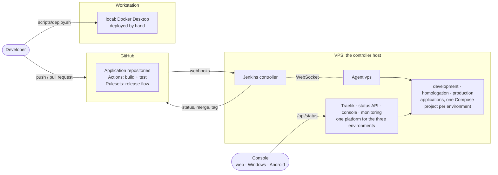
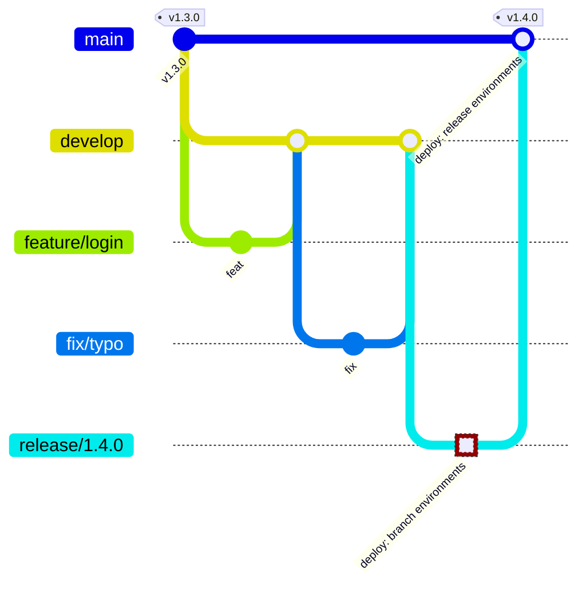
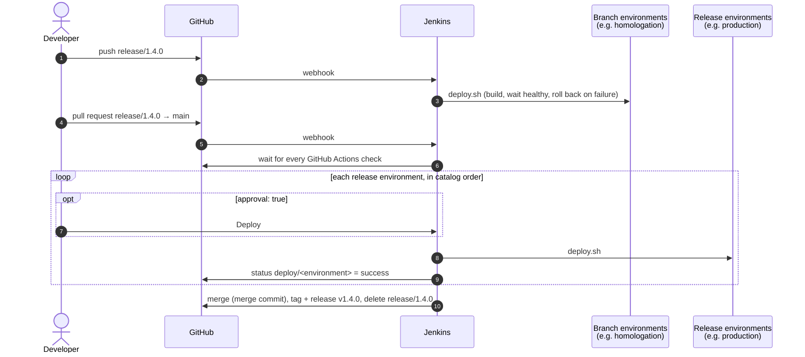
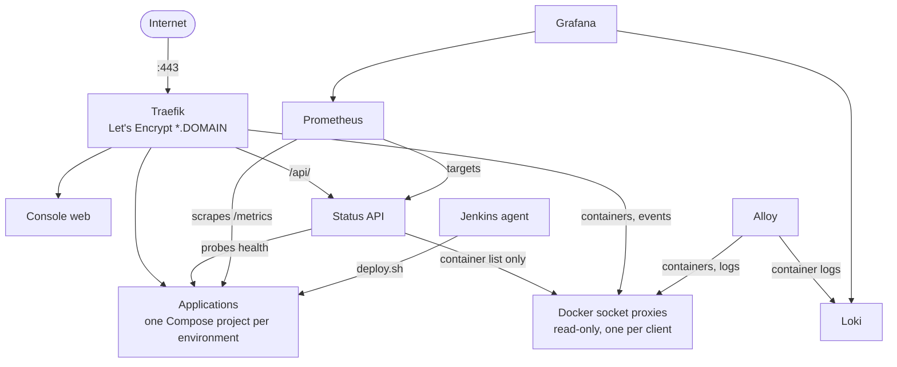

# yggdrasil

A self-hosted **deploy manager** for Docker applications. You describe your **systems** (products
made of one or more applications, such as an API and its web front end) and your **environments**
(development, homologation, production, or as many as you need, several of them on one host if you
like) in one catalog file. yggdrasil then:

- **Enforces a release flow on GitHub**: `feature/`/`fix/` → `develop` → `release/x.y.z` → `main`, tagged `vx.y.z`.
- **Deploys with a self-hosted Jenkins**, according to each environment's options:
  - on branch pushes, on a green release pull request, or by hand
  - with or without a manual approval
  - on the host that runs the environment, which may run others too
- **Rolls back** to the previous image when a deploy doesn't become healthy.
- **Serves applications** behind Traefik with Let's Encrypt wildcard certificates (DNS-01, any DNS provider).
- **Monitors everything**: Prometheus metrics and Loki logs, in Grafana.
- **Runs environments on demand**: development and homologation can stay stopped until someone uses them (`scripts/ygg.sh env start development`), next to an always-on production.
- **Shows it all in a console** for the web, Windows and Android. Each system has a status per environment; expand it to see each application's health, version, commit, deploy time and container state.

Adding an application, an environment or a whole system is a catalog entry, not a change to the platform.

That is the default setup, and [the worked example](docs/examples/docker-desktop-and-vps/README.md).
Each environment can also have a host of its own, or any mix: every host runs its own platform and
an agent that dials out to the one controller.

## Concepts

| | |
|---|---|
| **Application** | One deployable unit (an API, a web UI, a worker) with its own repository, container image and release cycle. |
| **System** | What users think of as one product: a group of applications that work together. The console shows a system's status and, expanded, each of its applications. |
| **Environment** | A stage applications run in, such as local, development, homologation or production. Options: exposure (`proxy` through Traefik or host `ports`), `trigger` (`manual`, `branch` or `release`), which Jenkins `agent` deploys it, whether it needs `approval`, `hostSuffix` (its host names, `heimdall-dev.<domain>`), `onDemand` (runs only while used), timeouts and rollback depth. Each application deploys to all environments or to its own list, and can override any option per environment. |
| **Host** | A machine with a Docker engine (a VPS, a VM) running one environment or several, with one platform stack (Traefik, status API, console, monitoring), one Jenkins agent and one domain for all of them. Each application runs once per environment, as its own Compose project. A workstation's `ports` environment needs no platform. |
| **Catalog** | [`catalog.yaml`](catalog.yaml): the environments, systems and applications. Jenkins jobs and agents, GitHub rulesets, deploys, the status API, Prometheus and the console all read it. Reference: [docs/catalog.md](docs/catalog.md). |

### Branches and releases

- `develop` and `main` only change through pull requests. Required checks: `branch-policy` (the Branch Policy workflow), the application's CI (the catalog's `checks`), and on `main` one `deploy/<environment>` status per release environment.
- Into `develop` go only `feature/*` and `fix/*` branches cut from `develop`.
- Into `main` go only `release/x.y.z` branches that are snapshots of `develop`, for a version not yet tagged.
- `v*` tags can't be moved or deleted.
- Repository admins can bypass all of it, for emergencies.

### What a release does

If a deploy fails, it rolls back to the image that was running, `deploy/<environment>` is set to failure, and the pull request stays open, blocked by the ruleset. **Rollback does not undo database migrations**, so keep each migration compatible with the previous release.

### Inside a host

Two Docker networks connect them: `edge` (Traefik, applications, status API) and `telemetry` (Prometheus and everything it scrapes). On both, an application is `<application>.<environment>` (`heimdall-api.production`), so the environments of a host never mix. No container publishes a port except Traefik (80, 443). Metrics are served on a private port that is neither published nor routed.

Only the Jenkins agent holds the Docker socket, since it deploys. Traefik, Alloy and the status API each read Docker through a socket proxy of their own, on a private network, that allows only the read-only requests that client makes. The status API, the one behind a token on the internet, gets the container list and nothing else: not the container inspect, which carries every application's secrets.

## The console

The same Flutter app on three platforms:

| | How to get it | Hosts |
|---|---|---|
| **Web** | `https://yggdrasil.<DOMAIN>` on each host | Starts on the host that serves it |
| **Windows** | `yggdrasil-console-<version>-setup.exe` from the GitHub releases. Per-user install by default, no administrator rights | Add each one (URL and token) in the **Hosts** screen, then switch from the overview |
| **Android** | `yggdrasil-console-<version>.apk` from the GitHub releases | Same as Windows (HTTPS only) |

- A **host** shows every environment it runs, each with its status, e.g. `Development · Stopped`, `Homologation · Stopped`, `Production · Up`.
- Every **system** is a card with one status chip per environment: its applications there taken together, `down` when every deployed one is down, `degraded` when any is down or degraded, else `unknown` or `up`; `not deployed` ones don't count ([the rules](docs/status-api.md#roll-up)). Problems sort first.
- **`Stopped`** is an on-demand environment switched off: neutral, not a problem.
- **Expanding** a system shows a section per environment, listing its applications, each with:
  - status and kind
  - version, commit and deploy time
  - latest health probe and latency
  - container state, health and restarts
  - links to the application and its repository
- Data comes from each host's **status API** (`GET /api/status`, bearer token), one for all its environments. The console refreshes every 30 s while visible; the API probes every 15 s.
- Contract: [docs/status-api.md](docs/status-api.md).

The installer and the APK are attached to every `v*` release of this repository by `.github/workflows/release.yml`.

## Getting started

**[docs/setup.md](docs/setup.md) is the step-by-step guide**, from an empty GitHub account to a
first release. In short:

| | Step | Guide |
|---|---|---|
| **Prepare** | Plan environments and hosts, install the tools, fork this repository | [0–2](docs/setup.md#0-plan-the-installation) |
| | Write `catalog.yaml` and the stack files | [3–4](docs/setup.md#3-write-the-catalog), [catalog.md](docs/catalog.md) |
| | Add the [`templates/application/`](templates/application) files to each application repository | [5](docs/setup.md#5-prepare-each-application-repository) |
| **Accounts** | A domain and its DNS (Cloudflare, or free with DuckDNS), and a GitHub App for Jenkins | [6–7](docs/setup.md#6-domain-and-dns), [dns.md](docs/dns.md) |
| **Hosts** | Bring up the controller host (in the default setup, the one VPS), any other host, then the application env files | [8–11](docs/setup.md#8-prepare-every-host) |
| **Finish** | Apply the GitHub rules, check everything, cut the first `release/x.y.z` | [12–14](docs/setup.md#12-apply-the-github-rules) |

On an Ubuntu host, [`scripts/ygg.sh`](docs/cli.md) does the host steps from a menu: it installs
the tools, sets up applications, shows what runs and changes their configuration.

[docs/examples/docker-desktop-and-vps](docs/examples/docker-desktop-and-vps/README.md) is the
default setup worked through on real hardware:
- `local` on Docker Desktop (Windows), deployed by hand
- `development` and `homologation`, on demand, and `production`, always on, all three on one
  Ubuntu VPS that also runs Jenkins

## Layout

| Path | What |
|---|---|
| `catalog.yaml` | Environments, systems and applications: what everything else reads |
| `stacks/` | Per-application Compose files and overlays: `<app>.proxy.yml`, `<app>.ports.yml`, optional `<app>.<environment>.yml` |
| `scripts/ygg.sh` | The host helper: a menu to install the tools, set up an application, see what runs, change an application's configuration and start or stop an on-demand environment ([docs/cli.md](docs/cli.md)) |
| `scripts/deploy.sh` | Build, label, deploy, health-wait and roll back one application in one environment, as the Compose project `<application>-<environment>`. Jenkins runs it; so can you |
| `scripts/catalog.py` | Validates the catalog and resolves each application's environment options |
| `scripts/platform.sh` | Brings a host's platform up or down: one per host, for all its environments |
| `scripts/github.sh` | The GitHub side of a release: wait for checks, set status, merge, release, delete branch |
| `platform/` | One host's platform: Traefik, status API, console, Docker socket proxies, Prometheus, Loki, Alloy, Grafana, and the Jenkins controller and agent |
| `jenkins/library/` | The shared pipeline every application's `Jenkinsfile` calls |
| `github/rulesets.py` | Rulesets, required checks and settings of every catalog repository |
| `status/` | The status API (.NET 10) |
| `console/` | The console (Flutter): web, Android, Windows |
| `env/` | Templates for each host's `platform.env` and `acme.env` |
| `templates/application/` | Files each application repository needs |
| `docs/` | Catalog reference, setup guide, host helper, DNS and certificates, status API contract, worked example (`docs/examples/docker-desktop-and-vps/`) |

## Day to day

| Task | How |
|---|---|
| Release an application | `git switch -c release/1.4.0 develop && git push -u origin release/1.4.0`, then open the PR into `main` |
| Deploy by hand | `scripts/deploy.sh <environment> <application> <checkout> <version>` on the environment's host, or "Build with Parameters" → `DEPLOY_TO` in Jenkins for `branch` environments and `manual` ones that set an `agent` (an on-demand environment is left running) |
| Use an on-demand environment | `scripts/ygg.sh env start development` on its host, then `env stop development` when done. Jenkins keeps deploying to it while it is stopped, and leaves it stopped ([setup.md](docs/setup.md#on-demand-environments)) |
| See which environments are on | `scripts/ygg.sh env status`, or the console |
| Add an application, environment or system | `scripts/ygg.sh add` for an application ([docs/cli.md](docs/cli.md#set-up-an-application)); [docs/setup.md#adding-things](docs/setup.md#adding-things) for all three |
| See what runs on a host | `scripts/ygg.sh status`: every environment of the host |
| Change an application's env file and redeploy it | `scripts/ygg.sh config <application> <environment>` |
| Update a host's platform or catalog | `cd /opt/yggdrasil && git pull && scripts/platform.sh up`, then restart `yggdrasil-status-1` (and `yggdrasil-jenkins-1` on the controller host) after a catalog change: [setup.md](docs/setup.md#where-jenkins-and-the-hosts-read-the-catalog) |
| Change GitHub rules | `python3 github/rulesets.py --dry-run`, then without |
| See what runs where | The console, or `curl -H "Authorization: Bearer $TOKEN" https://yggdrasil.<DOMAIN>/api/status` |

## Upgrading

Upgrading an existing installation from one release to the next is described in
[CHANGELOG.md](./CHANGELOG.md), under each release that asks something of the operator: from 0.4
to 0.5 (several environments per host), see
[Upgrading from 0.4 to 0.5](./CHANGELOG.md#upgrading-from-04-to-05).

## Changelog

Notable changes in each release are recorded in [CHANGELOG.md](./CHANGELOG.md). Releases follow
[Semantic Versioning](https://semver.org/).

## Contributing

Building and testing the status API, the console and the platform scripts, the branching model and the release
process of this repository are described in [CONTRIBUTING.md](./CONTRIBUTING.md).

## Legal

Proprietary. See [LICENSE](LICENSE). Copyright (c) 2026 Artur Rios. All rights reserved.
