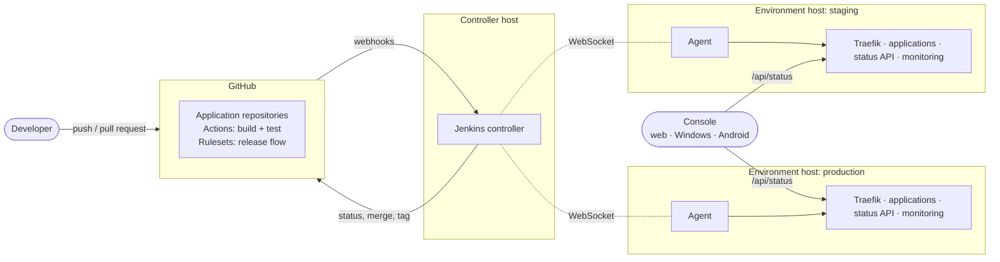
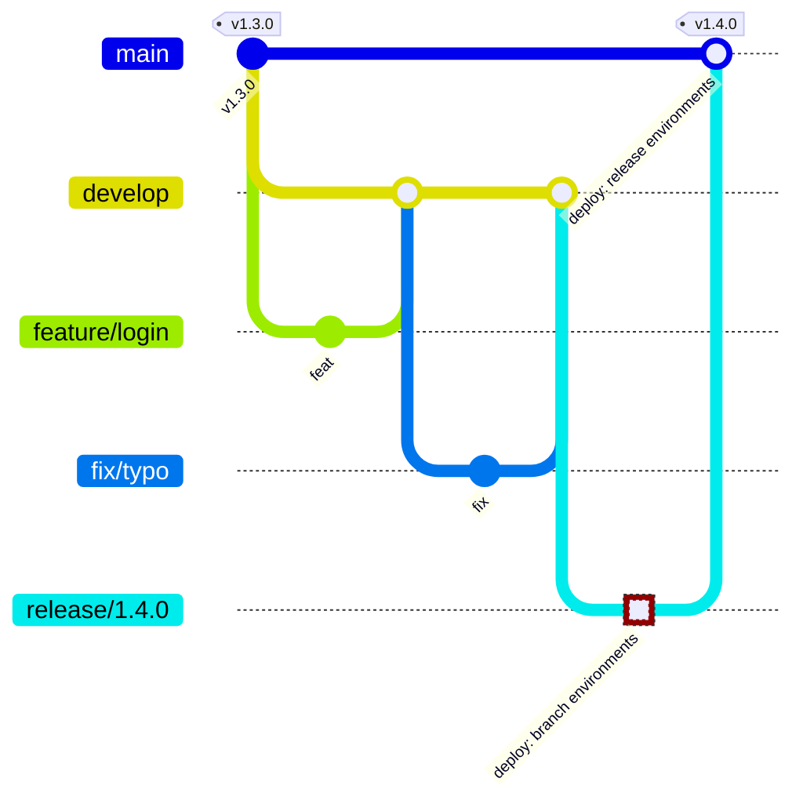
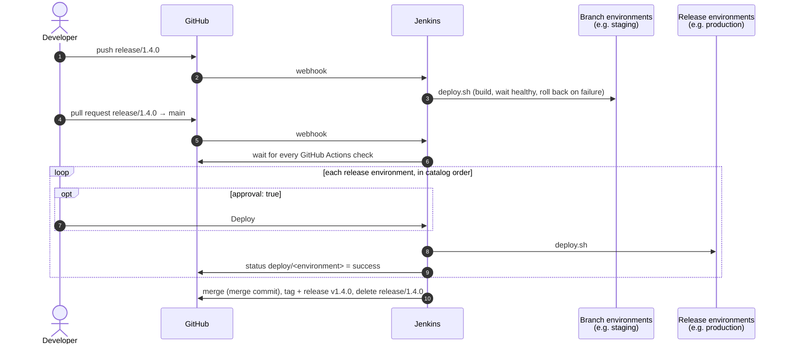
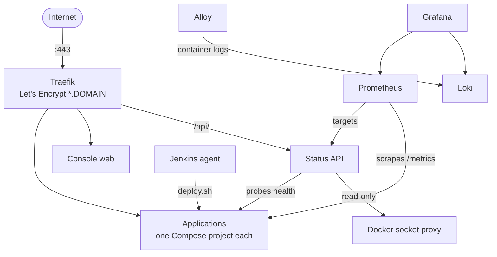

# yggdrasil

A self-hosted **deploy manager** for Docker applications. You describe your **systems** (products
made of one or more applications, such as an API and its web front end) and your **environments**
(development, staging, production, or as many as you need) in one catalog file. yggdrasil then:

- **Enforces a release flow on GitHub**: `feature/`/`fix/` → `develop` → `release/x.y.z` → `main`, tagged `vx.y.z`.
- **Deploys with a self-hosted Jenkins**, according to each environment's options:
  - on branch pushes, on a green release pull request, or by hand
  - with or without a manual approval
  - on the host that runs the environment
- **Rolls back** to the previous image when a deploy doesn't become healthy.
- **Serves applications** behind Traefik with Let's Encrypt wildcard certificates (DNS-01, any DNS provider).
- **Monitors everything**: Prometheus metrics and Loki logs, in Grafana.
- **Shows it all in a console** for the web, Windows and Android. Each system has a status; expand it to see each application's health, version, commit, deploy time and container state, per environment.

Adding an application, an environment or a whole system is a catalog entry, not a change to the platform.

## Concepts

| | |
|---|---|
| **Application** | One deployable unit (an API, a web UI, a worker) with its own repository, container image and release cycle. |
| **System** | What users think of as one product: a group of applications that work together. The console shows a system's status and, expanded, each of its applications. |
| **Environment** | A place applications run, such as a laptop, a staging host or production. Options: exposure (`proxy` through Traefik or host `ports`), `trigger` (`manual`, `branch` or `release`), which Jenkins `agent` deploys it, whether it needs `approval`, timeouts and rollback depth. Each application deploys to all environments or to its own list, and can override any option per environment. |
| **Catalog** | [`catalog.yaml`](catalog.yaml): the environments, systems and applications. Jenkins jobs and agents, GitHub rulesets, deploys, the status API, Prometheus and the console all read it. Reference: [docs/catalog.md](docs/catalog.md). |

### Branches and releases

- `develop` and `main` only change through pull requests. Required checks: `branch-policy` (the Branch Policy workflow), the application's CI (the catalog's `checks`), and on `main` one `deploy/<environment>` status per release environment.
- Into `develop` go only `feature/*` and `fix/*` branches cut from `develop`.
- Into `main` go only `release/x.y.z` branches that are snapshots of `develop`, for a version not yet tagged.
- `v*` tags can't be moved or deleted.
- Repository admins can bypass all of it, for emergencies.

### What a release does

If a deploy fails, it rolls back to the image that was running, `deploy/<environment>` is set to failure, and the pull request stays open, blocked by the ruleset. **Rollback does not undo database migrations**, so keep each migration compatible with the previous release.

### Inside an environment host

Two Docker networks connect them: `edge` (Traefik, applications, status API) and `telemetry` (Prometheus and everything it scrapes). No container publishes a port except Traefik (80, 443). Metrics are served on a private port that is neither published nor routed.

## The console

The same Flutter app on three platforms:

| | How to get it | Environments |
|---|---|---|
| **Web** | `https://yggdrasil.<DOMAIN>` on each environment host | Starts on the environment that serves it |
| **Windows** | `yggdrasil-console-<version>-setup.exe` from the GitHub releases. Per-user install by default, no administrator rights | Add each one (URL and token) in the **Environments** screen, then switch from the overview |
| **Android** | `yggdrasil-console-<version>.apk` from the GitHub releases | Same as Windows (HTTPS only) |

- Every **system** is a card with the worst status of its applications: `up`, `degraded`, `down`, `not deployed` or `unknown`. Problems sort first.
- **Expanding** a system lists its applications, each with:
  - status and kind
  - version, commit and deploy time
  - latest health probe and latency
  - container state, health and restarts
  - links to the application and its repository
- Data comes from each environment's **status API** (`GET /api/status`, bearer token). The console refreshes every 30 s while visible; the API probes every 15 s.
- Contract: [docs/status-api.md](docs/status-api.md).

The installer and the APK are attached to every `v*` release of this repository by `.github/workflows/release.yml`.

## Getting started

**[docs/setup.md](docs/setup.md) is the step-by-step guide**, from an empty GitHub account to a
first release. In short:

| | Step | Guide |
|---|---|---|
| **Prepare** | Plan environments and hosts, install the tools, fork this repository | [0–2](docs/setup.md#0-plan-the-installation) |
| | Write `catalog.yaml` and the stack files | [3–4](docs/setup.md#3-write-the-catalog), [catalog.md](docs/catalog.md) |
| | Add the [`templates/application/`](templates/application) files to each application repository | [5](docs/setup.md#5-prepare-each-application-repository) |
| **Accounts** | A domain and its DNS (Cloudflare, or free with DuckDNS), and a GitHub App for Jenkins | [6–7](docs/setup.md#6-domain-and-dns), [dns.md](docs/dns.md) |
| **Hosts** | Bring up the controller host, then every other environment host, then the application env files | [8–11](docs/setup.md#8-prepare-every-host) |
| **Finish** | Apply the GitHub rules, check everything, cut the first `release/x.y.z` | [12–14](docs/setup.md#12-apply-the-github-rules) |

[docs/examples/docker-desktop-wsl-vps](docs/examples/docker-desktop-wsl-vps/README.md) is a complete worked example on real hardware:
- development on Docker Desktop (Windows)
- a staging environment in WSL on the same machine
- production on a Linux VPS

## Layout

| Path | What |
|---|---|
| `catalog.yaml` | Environments, systems and applications: what everything else reads |
| `stacks/` | Per-application Compose files and overlays: `<app>.proxy.yml`, `<app>.ports.yml`, optional `<app>.<environment>.yml` |
| `scripts/deploy.sh` | Build, label, deploy, health-wait and roll back one application in one environment. Jenkins runs it; so can you |
| `scripts/catalog.py` | Validates the catalog and resolves each application's environment options |
| `scripts/platform.sh` | Brings a host's platform up or down |
| `scripts/github.sh` | The GitHub side of a release: wait for checks, set status, merge, release, delete branch |
| `platform/` | One host's platform: Traefik, status API, console, Docker socket proxy, Prometheus, Loki, Alloy, Grafana, and the Jenkins controller and agent |
| `jenkins/library/` | The shared pipeline every application's `Jenkinsfile` calls |
| `github/rulesets.py` | Rulesets, required checks and settings of every catalog repository |
| `status/` | The status API (.NET 10) |
| `console/` | The console (Flutter): web, Android, Windows |
| `env/` | Templates for each host's `platform.env` and `acme.env` |
| `templates/application/` | Files each application repository needs |
| `docs/` | Catalog reference, setup guide, DNS and certificates, status API contract, worked example |

## Day to day

| Task | How |
|---|---|
| Release an application | `git switch -c release/1.4.0 develop && git push -u origin release/1.4.0`, then open the PR into `main` |
| Deploy by hand | `scripts/deploy.sh <environment> <application> <checkout> <version>` on the environment's host, or "Build with Parameters" → `DEPLOY_TO` in Jenkins for `manual` environments that set an `agent` |
| Add an application, environment or system | [docs/setup.md#adding-things](docs/setup.md#adding-things) |
| Update a host's platform or catalog | `cd /opt/yggdrasil && git pull && scripts/platform.sh up`, then restart `yggdrasil-status-1` (and `yggdrasil-jenkins-1` on the controller host) after a catalog change: [setup.md](docs/setup.md#where-jenkins-and-the-hosts-read-the-catalog) |
| Change GitHub rules | `python3 github/rulesets.py --dry-run`, then without |
| See what runs where | The console, or `curl -H "Authorization: Bearer $TOKEN" https://yggdrasil.<DOMAIN>/api/status` |
