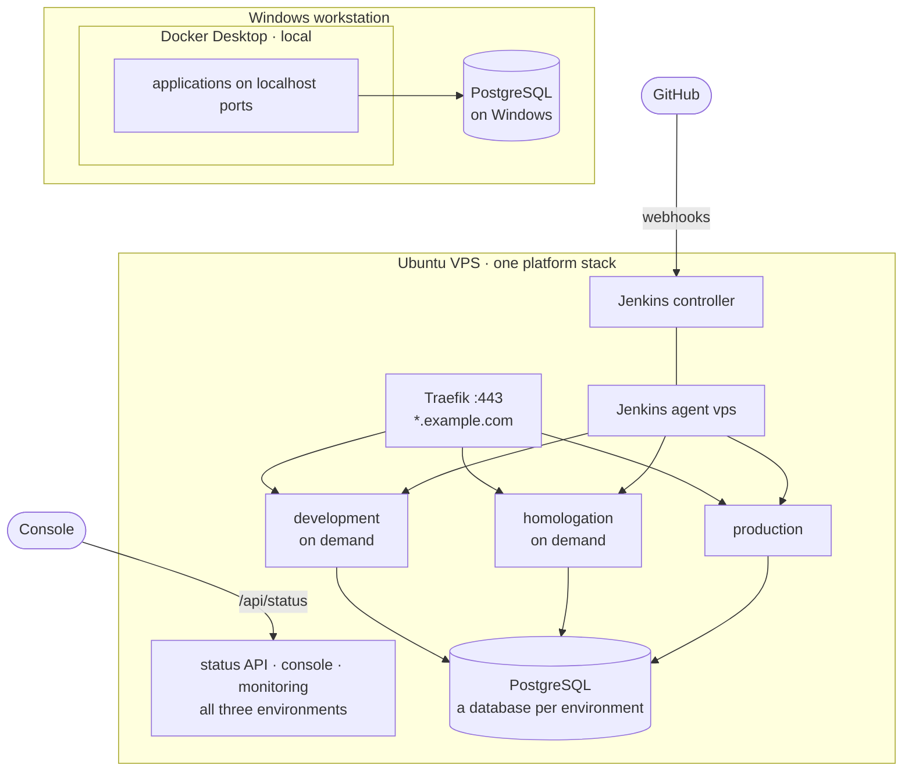

# Example: Docker Desktop and one VPS

A complete installation on two machines: a Windows workstation and one Ubuntu VPS. It is the
setup this repository's [`catalog.yaml`](../../../catalog.yaml) describes: two systems, heimdall and
fortuna, each an ASP.NET Core API with a Flutter web UI, and four environments, three of them on
the VPS.

| Environment | Where | `mode` | `trigger` | Runs | Reached at |
|---|---|---|---|---|---|
| `local` | Windows workstation, **Docker Desktop** | `ports` | `manual` | While you deploy it | `http://localhost:<port>` |
| `development` | The **VPS** | `proxy` | `branch` (`develop`) | On demand | `https://<host>-dev.example.com` |
| `homologation` | The **VPS** | `proxy` | `branch` (`release/*`) | On demand | `https://<host>-hml.example.com` |
| `production` | The **VPS**, which also runs the Jenkins controller | `proxy` | `release` | Always | `https://<host>.example.com` |



The environment section of the catalog:

```yaml
environments:
  - id: local
    name: Local
    mode: ports
    trigger: manual
  - id: development
    name: Development
    trigger: branch
    branches: develop
    agent: vps
    hostSuffix: -dev
    onDemand: true
  - id: homologation
    name: Homologation
    trigger: branch
    branches: release/*
    agent: vps
    hostSuffix: -hml
    onDemand: true
  - id: production
    name: Production
    trigger: release
    agent: vps
```

- The three VPS environments share one Docker engine, one platform stack, one `DOMAIN` and one
  Jenkins agent, `vps`. Each application runs in each of them as its own Compose project
  (`heimdall-api-development`, `heimdall-api-homologation`, `heimdall-api-production`), so they
  never replace each other's containers ([catalog.md](../../catalog.md#several-environments-on-one-host)).
- `hostSuffix` tells their host names apart under the one domain: `heimdall-dev.example.com`,
  `heimdall-hml.example.com`, `heimdall.example.com`.
- `onDemand` keeps development and homologation stopped until you need them, so they cost the VPS
  nothing while nobody uses them.

Env file templates for every application in each environment are in [`env/`](env). They use
`example.com` as the domain: replace it with yours, and fill in the secrets. In this page,
`example.com` stands for your domain too. Type the real value in the files: `platform.sh` reads
them with bash.

## DNS

Cloudflare hosts the domain (`ACME_DNS_PROVIDER=cloudflare`, `CF_DNS_API_TOKEN` in `acme.env`: an
API token with **Zone → Zone → Read** and **Zone → DNS → Edit** on the zone; step by step in
[dns.md](../../dns.md)). One record covers every environment of the VPS:

| Record | Points at | Proxy |
|---|---|---|
| `*.example.com` (name `*`) | The VPS's public IP | Either: **DNS only** to start, **Proxied** once the real certificate works ([dns.md A7](../../dns.md#a7-optional-the-cloudflare-proxy)) |

`heimdall-api-dev`, `heimdall-hml`, `fortuna`, `yggdrasil`, `jenkins` ... are all one label under
`example.com`, so the record and Traefik's one `*.example.com` certificate cover them, and adding
an application or an environment to the VPS never needs a DNS change. `local` needs no record:
it is reached at `localhost`.

## The VPS

Follow [setup.md](../../setup.md) steps 6 to 9, then 11: the VPS is the controller host and the
only host. The lines of `platform.env` this example fixes, on top of every variable of
[setup.md 9.2](../../setup.md#92-the-env-files-first-pass):

```
ENVIRONMENTS=development,homologation,production
DOMAIN=example.com
JENKINS_URL=https://jenkins.example.com/
# jenkins alone at step 9.2, jenkins,agent from step 9.5
COMPOSE_PROFILES=jenkins,agent
JENKINS_AGENT_NAME=vps
JENKINS_AGENT_URL=http://jenkins:8080/
```

Keep comments on their own lines, as here: `platform.sh` and Compose read the file differently, and
a comment after a value isn't safe in both.

Jenkins creates one agent, `vps`, for the three environments (**Manage Jenkins → Nodes → vps**: its
secret goes in `JENKINS_AGENT_SECRET` at step 9.5). One `YGGDRASIL_STATUS_TOKEN` covers the three
environments: the console reads all of them from the one status API.

Size the VPS for production plus whatever runs at the same time: each on-demand environment that is
on adds this example's four containers (two APIs, two web UIs), with their memory, next to
production's. Stop them when you are done (below).

### PostgreSQL

PostgreSQL runs on the VPS itself, one instance for the three environments, with **a database and a
login per environment and application**, so development and homologation can never reach
production's data. The env file templates of the API repositories name them:

| Application | `development` | `homologation` | `production` |
|---|---|---|---|
| heimdall-api | `heimdall_development`, login `heimdall_development_svc` | `heimdall_homologation`, login `heimdall_homologation_svc` | `heimdall`, login `heimdall_svc` |
| fortuna-api | `fortuna_development`, login `fortuna_development` | `fortuna_homologation`, login `fortuna_homologation` | `fortuna`, login `fortuna` |

Production keeps the database it has: create the others. Each `createuser` asks for the login's
password, which goes in that environment's env file (`DB_PASSWORD`):

```bash
sudo -u postgres createuser --pwprompt heimdall_development_svc && sudo -u postgres createdb --owner heimdall_development_svc heimdall_development
sudo -u postgres createuser --pwprompt heimdall_homologation_svc && sudo -u postgres createdb --owner heimdall_homologation_svc heimdall_homologation
sudo -u postgres createuser --pwprompt fortuna_development && sudo -u postgres createdb --owner fortuna_development fortuna_development
sudo -u postgres createuser --pwprompt fortuna_homologation && sudo -u postgres createdb --owner fortuna_homologation fortuna_homologation
```

The API stacks reach PostgreSQL at `DB_HOST=host.docker.internal`, which their Compose files map to
the host's Docker bridge (`extra_hosts: host-gateway`). By default PostgreSQL only listens on
`localhost`, and `ufw` drops the containers' connections, so:

1. `postgresql.conf`: `listen_addresses = 'localhost,172.17.0.1'` (the Docker bridge's address:
   `ip -4 addr show docker0`).
2. `pg_hba.conf`: one line per database and its login, from the Compose networks, e.g.
   `host heimdall_development heimdall_development_svc 172.16.0.0/12 scram-sha-256`, so each
   login reaches its own database and no other.
3. `sudo ufw allow from 172.16.0.0/12 to any port 5432 proto tcp`, then
   `sudo systemctl restart postgresql`.
4. Check from a container:
   `docker run --rm --add-host h:host-gateway postgres:17 pg_isready -h h` prints
   `h:5432 - accepting connections`.

### The env files

Twelve files, one per application and environment, in `/etc/yggdrasil/<environment>/` on the VPS
([setup.md step 11](../../setup.md#11-application-env-files)). For the APIs, start from the
repository's own `docker/<environment>.env.example`, which documents every variable and has that
environment's values; the templates in [`env/`](env) only list what yggdrasil relies on. The web
UIs have no template of their own: [`env/`](env) has their whole files.

```bash
install -d -m 2750 /etc/yggdrasil/development /etc/yggdrasil/homologation /etc/yggdrasil/production
cp ~/yggdrasil-apps/heimdall-api/docker/development.env.example /etc/yggdrasil/development/heimdall-api.env
cp /opt/yggdrasil/docs/examples/docker-desktop-and-vps/env/development/heimdall-ui.env.example /etc/yggdrasil/development/heimdall-ui.env
# ... and so on for each application and environment, then:
chmod 640 /etc/yggdrasil/*/*.env
```

`scripts/ygg.sh config <application> <environment>` opens one of them, and redeploys after a change
([cli.md](../../cli.md#change-the-configuration)).

**With the variables store** ([variables.md](../../variables.md)), the same templates are `vars import`
input and nothing is copied into `/etc/yggdrasil` by hand. On the VPS, once:

```bash
cd /opt/yggdrasil
scripts/ygg.sh vars init                  # prints the key: store it in your password manager
e=docs/examples/docker-desktop-and-vps/env
scripts/ygg.sh vars import heimdall-api@development ~/yggdrasil-apps/heimdall-api/docker/development.env.example
scripts/ygg.sh vars import heimdall-ui@development  $e/development/heimdall-ui.env.example
scripts/ygg.sh vars edit heimdall-api@development    # fill in DB_PASSWORD and the secrets
# ... and so on for each application and environment
```

Then give the values the environments share one home. `DB_HOST` is `host.docker.internal` in
every application of an environment, so it moves up to `@development` (with `vars import --all` it
is offered as a move-up; by hand: `vars set @development DB_HOST=...`, then `vars unset` it from the
applications). fortuna-api's `FORTUNA_AUTH_TOKEN_SECRET` is heimdall-api's
`HEIMDALL_AUTH_TOKEN_SECRET` of the same environment, so it becomes a reference instead of a copy:

```bash
scripts/ygg.sh vars set fortuna-api@development FORTUNA_AUTH_TOKEN_SECRET='${ref:heimdall-api:HEIMDALL_AUTH_TOKEN_SECRET}'
scripts/ygg.sh vars list fortuna-api@development --resolved
```

## Local: Docker Desktop

No platform stack and no Jenkins: `deploy.sh` publishes each application on the workstation and
points the APIs at the PostgreSQL installed on Windows (`heimdall_local`, `fortuna_local`). From Git
Bash, in your checkout of the fork, with the application repositories cloned next to it
(`../heimdall-api`, `../heimdall-ui`, ...):

```bash
python3 --version && pip install pyyaml              # once, for scripts/catalog.py
export YGG_SECRETS_DIR="$PWD/env"                    # filled-in env/**/*.env files are gitignored
mkdir -p env/local
cp ../heimdall-api/docker/local.env.example env/local/heimdall-api.env   # and fill in
cp docs/examples/docker-desktop-and-vps/env/local/heimdall-ui.env.example env/local/heimdall-ui.env
scripts/deploy.sh local heimdall-api ../heimdall-api dev
scripts/deploy.sh local heimdall-ui  ../heimdall-ui  dev
```

| Application | Address | Env file starts from |
|---|---|---|
| heimdall-api | `http://localhost:8080` | `heimdall-api/docker/local.env.example` |
| fortuna-api | `http://localhost:8083` | `fortuna-api/docker/local.env.example` |
| heimdall-ui | `http://localhost:8081` (on `127.0.0.1` only) | [`env/local/heimdall-ui.env.example`](env/local/heimdall-ui.env.example) |
| fortuna-ui | `http://localhost:8082` (on `127.0.0.1` only) | [`env/local/fortuna-ui.env.example`](env/local/fortuna-ui.env.example) |

- If `python3 --version` opens the Microsoft Store, install Python from python.org and turn off the
  `python3` *App execution alias* in Windows settings: `deploy.sh` calls `python3`.
- The APIs' local templates publish on every interface, for testing from a phone; write
  `API_PORT=127.0.0.1:8080` to keep an API on this machine only.
- Docker Desktop forwards the containers' connections to PostgreSQL through its own VM, so Windows'
  PostgreSQL sees them come from `127.0.0.1`: its stock `pg_hba.conf` already allows them.
- Without yggdrasil, each API repository also runs on its own:
  `docker compose --env-file docker/local.env up -d --build`. To debug from the IDE, run the APIs
  with `dotnet run` and the UIs with `flutter run`.

## The applications

Each system is an API plus a Flutter web UI:

| Application | Host (`hostSuffix` added per environment) | Health | Metrics |
|---|---|---|---|
| `heimdall-api` | `heimdall-api` | `/healthcheck` | `:9464` |
| `heimdall-ui` | `heimdall` | `/healthz` | — |
| `fortuna-api` | `fortuna-api` | `/healthcheck` | `:9464` |
| `fortuna-ui` | `fortuna` | `/healthz` | — |

- **Same-origin APIs.** Each web UI calls its API on its own origin. It's built with
  `https://<ui host>` as its API base URL, and the API's proxy overlay also routes
  `https://<ui host>/api/…` to the API (every API route already starts with `/api/`). So the browser
  needs no CORS, which matters because fortuna-api has no CORS support at all. The APIs keep their
  own host names for the mobile and desktop clients.
- **Service to service.** fortuna-api validates tokens against the heimdall-api **of its own
  environment**. It requires HTTPS for that, so it calls heimdall-api's public host through Traefik
  (`https://heimdall-api-dev.example.com/` in development), not its alias on the `edge` network
  (`heimdall-api.development`). Its `FORTUNA_AUTH_TOKEN_SECRET` is that environment's
  `HEIMDALL_AUTH_TOKEN_SECRET`.
- **ASP.NET environments.**

  | | `local` | `development` | `homologation` | `production` |
  |---|---|---|---|---|
  | heimdall-api | `Development` | `Development` | `Staging` | `Production` |
  | fortuna-api | `Development` | `Development` | `Production` | `Production` |

  heimdall-api runs homologation as `Staging`, so e-mails are logged instead of sent and no Mailgun
  account is needed. fortuna-api runs it as `Production`, because it treats every other ASP.NET
  environment as a debugging one. Development exposes Swagger and the developer exception page on
  the internet: one more reason to keep it stopped while nobody uses it.

## Day to day

| Task | How |
|---|---|
| Work on `develop` | `scripts/ygg.sh env start development` on the VPS, then use `https://heimdall-dev.example.com` |
| Test a release | Push `release/x.y.z`, then `scripts/ygg.sh env start homologation` |
| Try a branch Jenkins doesn't deploy by itself | In Jenkins, the application's job → the branch (`develop`, `release/*` or `main`) → **Build with Parameters** → `DEPLOY_TO` `development`: deploys it and leaves development running |
| Done for now | `scripts/ygg.sh env stop development` (or `homologation`) |
| See what is on | `scripts/ygg.sh env status`, or the console |

What Jenkins does meanwhile:

- A push to `develop` deploys development; a push of `release/x.y.z`, homologation. If the
  environment is **stopped**, the deploy still builds the new version, starts it, waits for it to
  be healthy (rolling back a broken one as usual) and **stops it again**: the next
  `env start` runs the new version. If it is on, it stays on.
- The release pull request deploys production, which is always on, then merges and tags.

**The console** (`https://yggdrasil.example.com`, or the Windows and Android apps with one host:
that URL and the VPS's `YGGDRASIL_STATUS_TOKEN`) shows the VPS as one host with its three
environments. Each system card has a chip per environment, e.g. `Development · Stopped`,
`Homologation · Stopped`, `Production · Up`; expanded, a section per environment lists its
applications. `Stopped` is neutral, not a problem: it doesn't count for *Problems only*.
`local` isn't shown: it has no status API.

**Logs and metrics** in Grafana (`https://grafana.example.com`) carry an `environment` label:
`{environment="homologation"}` in Loki, where `stack` is the Compose project
(`heimdall-api-homologation`); `environment="production"` on the APIs' metrics in Prometheus.
