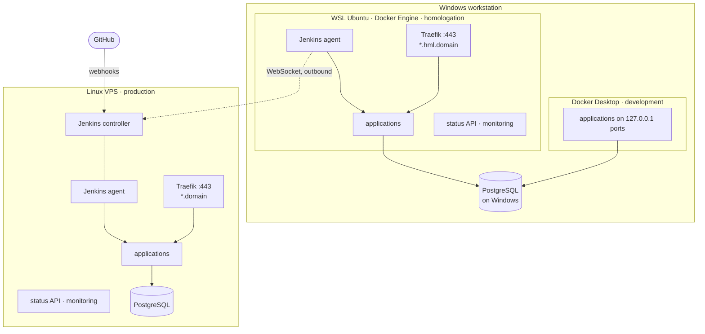

# Example: Docker Desktop, WSL and a Linux VPS

A complete installation on two machines: a Windows workstation and a Linux VPS. It is the setup
this repository's `catalog.yaml` describes: two systems, each an ASP.NET Core API with a Flutter
web UI, and three environments.

| Environment | Where | `mode` | `trigger` | Reached at |
|---|---|---|---|---|
| `development` | Windows workstation, **Docker Desktop** | `ports` | `manual` | `http://127.0.0.1:<port>` |
| `homologation` | Same workstation, **Docker Engine inside WSL Ubuntu** | `proxy` | `branch` (`release/*`) | `https://*.hml.<domain>` |
| `production` | **Linux VPS** (Ubuntu), also runs the Jenkins controller | `proxy` | `release` | `https://*.<domain>` |



The environment section of the catalog:

```yaml
environments:
  - id: development
    name: Development
    mode: ports
    trigger: manual
  - id: homologation
    name: Homologation
    mode: proxy
    trigger: branch
    branches: release/*
  - id: production
    name: Production
    mode: proxy
    trigger: release
```

Env file templates for every application in each environment are in [`env/`](env). Fill in
`<domain>` and the secrets.

## DNS

Cloudflare hosts the domain (`ACME_DNS_PROVIDER=cloudflare`, `CF_DNS_API_TOKEN` in `acme.env`: an API token with **Zone → DNS → Edit**).

| Record | Points at | Proxy |
|---|---|---|
| `*.<domain>` | The VPS's public IP | Either |
| `*.hml.<domain>` | The workstation's **LAN** IP | **DNS only** (grey cloud) |

Homologation is only reachable on the LAN. The DNS-01 challenge still issues it a real certificate, because Let's Encrypt never has to connect to it. Some home routers drop DNS answers that point at private addresses ("DNS rebinding protection"). If `*.hml.<domain>` doesn't resolve at home, allow the domain in the router, or add hosts-file entries.

## Production: the VPS

Follow [setup.md](../../setup.md) steps 3 and 5, with:

```bash
sudo ufw allow OpenSSH && sudo ufw allow 80,443/tcp && sudo ufw enable
```

`platform.env`:

```
ENVIRONMENT=production
DOMAIN=<domain>
COMPOSE_PROFILES=jenkins,agent        # jenkins alone on the very first run
JENKINS_URL=https://jenkins.<domain>/
JENKINS_AGENT_NAME=production
JENKINS_AGENT_URL=http://jenkins:8080/
```

PostgreSQL runs on the VPS itself. The API stacks reach it at `DB_HOST=host.docker.internal`, which their Compose files map to the host (`extra_hosts: host-gateway`).

## Homologation: WSL Ubuntu on the workstation

Homologation needs its **own** Docker Engine, separate from Docker Desktop's: one environment per engine.

1. **Separate the engines.** Docker Desktop → Settings → Resources → WSL integration: **turn it off for this distribution**. Otherwise `docker` inside Ubuntu *is* Docker Desktop, the development engine, and the two environments would replace each other's containers.
2. **Docker Engine inside Ubuntu** (same install as the VPS), with systemd: `/etc/wsl.conf` → `[boot]` `systemd=true`, then `wsl --shutdown`.
3. **Mirrored networking.** In `%UserProfile%\.wslconfig`, `[wsl2]` `networkingMode=mirrored`. This makes WSL's ports 80/443 the workstation's own, and lets WSL reach services on Windows. Then allow inbound 80/443 for WSL in the Hyper-V firewall, so other LAN devices (a phone testing the app) can reach it. **Docker Desktop must not publish 80 or 443 at the same time.**
4. **PostgreSQL.** Keep using the one installed on Windows: with mirrored networking, `DB_HOST=host.docker.internal` resolves to the host, and `pg_hba.conf` must allow the WSL address. Or, closer to production, install PostgreSQL inside WSL.
5. **The platform**, as in [setup.md](../../setup.md) step 4:
   ```
   ENVIRONMENT=homologation
   DOMAIN=hml.<domain>
   COMPOSE_PROFILES=agent
   JENKINS_URL=https://jenkins.<domain>/
   JENKINS_AGENT_NAME=homologation
   JENKINS_AGENT_URL=                   # empty: dials the VPS out over WebSocket, no inbound port
   ```
6. **Keep WSL running.** WSL stops when idle, and homologation deploys queue until it's back. A scheduled task at log-on running `wsl -d Ubuntu --exec sleep infinity` keeps it up.

## Development: Docker Desktop

No platform stack and no Jenkins: `deploy.sh` publishes each application on `127.0.0.1` and points it at the PostgreSQL on Windows. From Git Bash:

```bash
pip install pyyaml                                   # once, for scripts/catalog.py
export YGG_SECRETS_DIR=D:/Repositories/yggdrasil/env # filled-in *.env files there are gitignored
mkdir -p env/development
cp ../heimdall-api/docker/local.env.example env/development/heimdall-api.env   # and fill in
cp docs/examples/docker-desktop-wsl-vps/env/development/heimdall-ui.env.example env/development/heimdall-ui.env
scripts/deploy.sh development heimdall-api ../heimdall-api dev
scripts/deploy.sh development heimdall-ui  ../heimdall-ui  dev
```

To debug from the IDE, keep running the APIs with `dotnet run` and the UIs with `flutter run -d chrome`.

## The applications

Each system is an API plus a Flutter web UI:

| Application | Public host | Health | Metrics |
|---|---|---|---|
| `heimdall-api` | `heimdall-api.<DOMAIN>` | `/healthcheck` | `:9464` |
| `heimdall-ui` | `heimdall.<DOMAIN>` | `/healthz` | — |
| `fortuna-api` | `fortuna-api.<DOMAIN>` | `/healthcheck` | `:9464` |
| `fortuna-ui` | `fortuna.<DOMAIN>` | `/healthz` | — |

- **Same-origin APIs.** Each web UI calls its API on its own origin. It's built with `https://<ui-host>` as its API base URL, and the API's proxy overlay also routes `https://<ui-host>/api/…` to the API (every API route already starts with `/api/`). So the browser needs no CORS, which matters because fortuna-api has no CORS support at all. The APIs keep their own host names for the mobile and desktop clients.
- **Service to service.** fortuna-api validates tokens against heimdall-api over the `edge` network, at `http://heimdall-api:8080/`, not through the internet.
- **Homologation environment names.** heimdall-api runs as `Staging`, so e-mails are logged instead of sent and no Mailgun account is needed. fortuna-api runs as `Production`, because it treats every other ASP.NET environment as a debugging one.
- **API env files.** Start each from the application repository's own `docker/production.env.example`, then apply the template here: `PUBLIC_HOST`, `UI_HOST`, `ASPNETCORE_ENVIRONMENT`, `DB_HOST` and the other overrides.

## The console

- Web: `https://yggdrasil.<domain>` and `https://yggdrasil.hml.<domain>`.
- Windows or Android: add both environments in Settings, with each host's `YGGDRASIL_STATUS_TOKEN`.
- For the production web console to also show homologation, set `YGGDRASIL_STATUS_CORS_ORIGINS=https://yggdrasil.<domain>` in homologation's `platform.env`.
