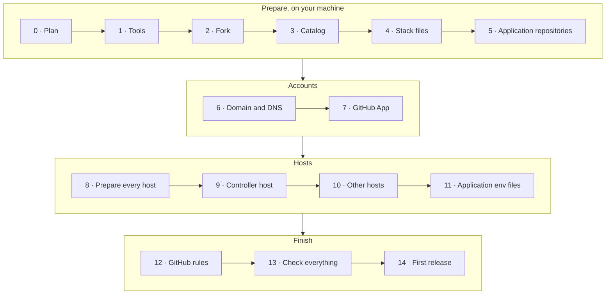

# Setting up yggdrasil

This guide takes you from nothing to a first release deployed by yggdrasil. Follow the steps in
order: each one only needs what the previous ones produced. For a complete installation on real
hardware (Docker Desktop, WSL and a VPS), see
[examples/docker-desktop-wsl-vps](examples/docker-desktop-wsl-vps/README.md).



| Step | Where | Time |
|---|---|---|
| [0. Plan the installation](#0-plan-the-installation) | Paper | 10 min |
| [1. Install the tools](#1-install-the-tools-on-your-machine) | Your machine | 10 min |
| [2. Fork yggdrasil](#2-fork-yggdrasil) | GitHub, your machine | 5 min |
| [3. Write the catalog](#3-write-the-catalog) | Your machine | 20 min |
| [4. Write the stack files](#4-write-the-stack-files) | Your machine | 10 min per application |
| [5. Prepare each application repository](#5-prepare-each-application-repository) | Each application repository | 10 min per application |
| [6. Domain and DNS](#6-domain-and-dns) | DNS provider | 15 min, plus propagation |
| [7. Create the GitHub App](#7-create-the-github-app) | GitHub | 10 min |
| [8. Prepare every host](#8-prepare-every-host) | Each host | 15 min per host |
| [9. Bring up the controller host](#9-bring-up-the-controller-host) | Controller host | 30 min |
| [10. Bring up the other hosts](#10-bring-up-the-other-environment-hosts) | Each other host | 15 min per host |
| [11. Application env files](#11-application-env-files) | Each host | 5 min per application |
| [12. Apply the GitHub rules](#12-apply-the-github-rules) | Your machine | 5 min |
| [13. Check everything](#13-check-everything) | Browser | 10 min |
| [14. The first release](#14-the-first-release) | An application repository | 10 min |

## 0. Plan the installation

Decide these before touching anything, and write the answers down: every later step uses them.

| Decision | Example | Notes |
|---|---|---|
| **GitHub owner** | `acme` | The user or organisation that owns the application repositories. Your fork of yggdrasil goes there too. |
| **Environments**, in promotion order | `development`, `staging`, `production` | For each: its `trigger` (`manual`, `branch` or `release`) and `mode` (`proxy`, or `ports` for a laptop). See [catalog.md](catalog.md#environments). |
| **One host per environment** | staging: a VM; production: a VPS | One Docker engine per environment: two environments on one engine would replace each other's containers. A VM or a WSL distribution counts as a host. A `ports` environment (a laptop) needs no host setup. |
| **The controller host** | production's VPS | The one host that also runs the Jenkins controller. It must be reachable from the internet on 443, for GitHub's webhooks. |
| **Domain per `proxy` environment** | `example.dev`, `staging.example.dev` | Every public name is one label under it. Your own domain on Cloudflare, or a free DuckDNS subdomain: [dns.md](dns.md). |
| **Systems and applications** | `shop` = `shop-api` + `shop-web` | Each application is one repository with a Dockerfile and a `/health`-style endpoint. |

A minimal installation is **one** environment (`production`, `trigger: release`) on **one** host
that also runs the controller. Start there if you are trying yggdrasil out; adding environments
later is a catalog entry and a host ([Adding things](#adding-things)).

### What each host needs

- Linux with **Docker Engine** and the **Compose plugin** (v2.24 or later, for `!reset` in the overlays): a VPS, a VM, a WSL
  distribution with its own engine.
- Roughly **2 GB of RAM** for the platform of an environment host, **4 GB** for the one that also
  runs the Jenkins controller, plus what your applications need.
- `git`, `bash`, `openssl`, and `python3` with PyYAML.
- Inbound **443** (and 80, for the HTTP→HTTPS redirect) from wherever the applications are used.
  Nothing else inbound.

## 1. Install the tools on your machine

On the machine you work from (Linux, macOS, or Windows with Git Bash):

| Tool | Why | Install |
|---|---|---|
| `git` | Everything | [git-scm.com](https://git-scm.com/downloads) |
| `python3` + PyYAML | Validating the catalog, applying the GitHub rules | `pip install pyyaml` (Ubuntu: `sudo apt install python3-yaml`) |
| GitHub CLI `gh` | Applying the GitHub rules | [cli.github.com](https://cli.github.com), then `gh auth login` as an admin of the repositories |
| `openssl` | Generating tokens, converting the GitHub App key | Included with Git Bash, macOS and most Linux distributions |
| `ssh` | Reaching the hosts | Included |

Check them:

```bash
git --version && python3 -c "import yaml; print('PyYAML ok')" && gh auth status && openssl version
```

On Windows, use `python` if `python3` isn't on the path.

## 2. Fork yggdrasil

Your installation lives in your own copy of this repository: your catalog, your stack files. Its
**`main`** branch is what counts: every host runs a checkout of it, and every deploy clones it
([details](#where-jenkins-and-the-hosts-read-the-catalog)).

1. On GitHub, **Fork** this repository into your owner (step 0). For a private copy, use
   *Import repository* or create an empty private repository and push a clone to it: forks of
   public repositories can't be private.
2. Clone it:
   ```bash
   git clone https://github.com/<owner>/<repository>.git
   cd <repository>
   ```

## 3. Write the catalog

[`catalog.yaml`](../catalog.yaml) describes the installation. The one in the repository is a
working example ([examples/docker-desktop-wsl-vps](examples/docker-desktop-wsl-vps/README.md)):
replace it with yours. Full reference: [catalog.md](catalog.md).

1. **Top level**: `owner` is your GitHub owner. `repository` is your fork's name (omit it if it's
   `yggdrasil`).
2. **`environments`**: the ones from step 0, in promotion order. For example:
   ```yaml
   environments:
     - id: staging
       name: Staging
       trigger: branch
       branches: release/*
     - id: production
       name: Production
       trigger: release
       approval: true
   ```
3. **`systems`**: replace `heimdall` and `fortuna` with your systems and applications. For each
   application:
   - `id`: the repository name (or set `repository`).
   - `kind`: `api`, `web` or `worker`.
   - `health`: the URL the status API probes over the Docker network, `http://<id>:<port>/<path>`.
   - `host`: its public host name under `DOMAIN`, if it has one.
   - `metrics`: `<id>:<port>`, if it exposes Prometheus metrics.
   - `checks`: the names of the GitHub Actions jobs that run on **every** pull request of that
     repository. Look them up in a recent pull request's *Checks* tab, which shows
     `<workflow> / <job>`: write only the job part (`test`, not `CI / test`). Don't list
     `branch-policy`: it's always required.
4. **Keep the `yggdrasil` system** at the end as it is: it makes the console show the platform's
   own health.
5. Validate, and see what each application will do where:
   ```bash
   python3 scripts/catalog.py validate
   python3 scripts/catalog.py plan <application-id>
   ```

## 4. Write the stack files

`scripts/deploy.sh` combines Compose files from `stacks/` with the application's repository. The
ones in `stacks/` are working examples: copy the closest one and rename what it names.

| The application's repository | Files to add in `stacks/` |
|---|---|
| **Has its own `docker-compose.yml`** | `<id>.proxy.yml`: Traefik labels, the `edge` and `telemetry` networks with the alias `<id>`, and `ports: !reset []`. Example: [heimdall-api.proxy.yml](../stacks/heimdall-api.proxy.yml). |
| **Has only a Dockerfile** | `<id>.yml`: the service, built from `${APP_DIR}` and tagged `<id>:${IMAGE_TAG}`. Plus `<id>.proxy.yml`, and `<id>.ports.yml` if a `ports` environment deploys it. Examples: [heimdall-ui.yml](../stacks/heimdall-ui.yml) and its overlays. |

Rules to keep:
- The router names and the network alias are the application's `id`.
- In `proxy` mode, nothing publishes a host port: only Traefik does.
- Host names come from the env file (`PUBLIC_HOST`, `UI_HOST`), not hard-coded.
- Use named volumes, not relative bind mounts (`./data:/data`). Under Jenkins, Compose runs inside
  the agent container, so a relative path points into the agent's workspace, not the host.

Delete the example stack files of applications you removed from the catalog. Then check and publish:

```bash
python3 scripts/catalog.py validate
git add -A && git commit -m "chore: describe this installation" && git push origin main
```

Push to **`main`**: it's the branch Jenkins and the hosts read.

## 5. Prepare each application repository

For every application in the catalog:

1. **A Dockerfile** that builds the application, and a **health endpoint** matching the catalog's
   `health`. Give the container a health check (`HEALTHCHECK` in the Dockerfile, or `healthcheck:`
   in the Compose file): `deploy.sh` waits for it to report healthy, and rolls back if it doesn't.
2. **A `develop` branch.** If the repository has none:
   ```bash
   git switch main && git pull && git switch -c develop && git push -u origin develop
   ```
3. **The three template files** from [`templates/application/`](../templates/application), on
   `develop`:
   - `Jenkinsfile`: replace `<application-id>` with the catalog id.
   - `.github/workflows/branch-policy.yml`: as is.
   - `CONTRIBUTING.md`: replace `<owner>` and `<application-id>`.
4. **CI** that runs the jobs listed in the catalog's `checks` on pull requests into `develop` and
   `main`.
5. Commit and push to `develop`. Until the rules are applied (step 12) a direct push works; after,
   only pull requests do.

## 6. Domain and DNS

Follow [dns.md](dns.md) up to and including **A4** (Cloudflare) or **B1** (DuckDNS). By the end
you have:

- a `*.<DOMAIN>` record (or DuckDNS subdomain) per `proxy` environment, pointing at its host's
  public IP;
- your DNS provider's API credential, which goes into each host's `acme.env` at step 9.2 or 10.

Check each one resolves, from any machine:

```bash
nslookup yggdrasil.<DOMAIN> 1.1.1.1
```

It must print the host's IP. Test a name **under** the domain: the bare `<DOMAIN>` has no record.

The controller's address will be `https://jenkins.<DOMAIN>`, with the `DOMAIN` of the environment
whose host runs it. Note it down: steps 7 and 9 need it.

## 7. Create the GitHub App

Jenkins talks to GitHub as a GitHub App, not as you. So it doesn't inherit your ruleset bypass, and
its merges go through the same rules as everyone's.

By the end of this step you have two things, both needed in step 9:

| What | Where it goes |
|---|---|
| The app's **App ID**, a number like `1234567` | `GITHUB_APP_ID` in the controller's `platform.env` |
| The app's **private key**, a `.pem` file | `/etc/yggdrasil/github-app.pem` on the controller host |

Create the app under the **same owner** as the repositories (the `owner` in `catalog.yaml`): your
personal account, or the organisation.

### 7.1 Open the form

| Owner | Path | Direct link |
|---|---|---|
| Personal account | Profile picture (top right) → **Settings** → **Developer settings** (last item of the left sidebar) → **GitHub Apps** → **New GitHub App** | `https://github.com/settings/apps/new` |
| Organisation | The organisation's page → **Settings** → **Developer settings** → **GitHub Apps** → **New GitHub App** | `https://github.com/organizations/<owner>/settings/apps/new` |

Creating an app in an organisation needs you to be one of its owners. GitHub may ask for your
password or a two-factor code before showing the form.

### 7.2 Fill in the form

The form is one long page. Go through it top to bottom:

**Basic information**

| Field | Value | Why |
|---|---|---|
| GitHub App name | Anything unique on GitHub, e.g. `acme-yggdrasil` | Shown as the author of Jenkins' merges, tags and statuses |
| Description | Optional, e.g. `Deploys with yggdrasil` | |
| Homepage URL | `https://jenkins.<DOMAIN>` | Required by the form, only informational. `<DOMAIN>` is the domain of the controller's environment, from step 6 |

**Identifying and authorizing users**, and **Post installation**: leave every field empty and every
box unchecked. Jenkins acts as the app, never on behalf of a user.

**Webhook**

| Field | Value | Why |
|---|---|---|
| Active | **Unchecked for now** | The controller doesn't exist yet, and GitHub would pile up failed deliveries. Step 9.4 checks it |
| Webhook URL | `https://jenkins.<DOMAIN>/github-webhook/`, trailing slash included | Where GitHub notifies Jenkins of pushes and pull requests. Fill it in now if the form allows; otherwise in step 9.4 |
| Webhook secret | Empty | |
| SSL verification | Enabled | The controller has a real certificate by the time the webhook is active |

**Permissions → Repository permissions.** Expand the section, and set exactly these; leave every
other one at *No access*:

| Permission | Access | What Jenkins does with it |
|---|---|---|
| Contents | Read and write | Checks the code out, merges the release pull request, creates the `vx.y.z` tag and release, deletes the release branch |
| Pull requests | Read and write | Finds release pull requests and merges them |
| Commit statuses | Read and write | Sets the `deploy/<environment>` statuses that `main`'s ruleset requires |
| Checks | Read-only | Waits for every GitHub Actions check of a release pull request before deploying |
| Metadata | Read-only | Selected automatically: every app has it |

**Organization permissions** and **Account permissions**: leave them all at *No access*.

**Subscribe to events.** This list only shows events the permissions above allow, so set the
permissions first. Check:

| Event | Why |
|---|---|
| Push | A pushed branch that matches an environment's `branches` deploys there |
| Pull request | A `release/x.y.z → main` pull request starts the release |
| Repository | Jenkins notices renamed or deleted repositories |

If the events can't be checked while the webhook is inactive, check them in step 9.4 when you
activate it.

**Where can this GitHub App be installed?** **Only on this account.** Nobody else should install
your deploy app.

Click **Create GitHub App**.

### 7.3 Note the App ID

GitHub opens the app's **General** page. In the **About** section at the top, copy the **App ID**
(a number). Don't confuse it with the **Client ID** just below it, which starts with `Iv`: Jenkins
doesn't use the client ID.

You can come back to this page any time: **Developer settings → GitHub Apps → Edit** next to the app.

### 7.4 Generate the private key

1. On the same **General** page, scroll to **Private keys** at the bottom.
2. Click **Generate a private key**. Your browser downloads a file named like
   `acme-yggdrasil.2026-09-25.private-key.pem`.
3. Keep it somewhere safe until step 9.1 copies it to the controller host, then delete your copy.

The key lets anyone act as the app on every repository it's installed on: never commit it, and
never paste it in a chat or an issue. GitHub keeps only its public half, so it can't show you the
key again. If you lose it or it leaks, generate a new one here and **Delete** the old one: the App ID
stays the same, only `/etc/yggdrasil/github-app.pem` changes.

### 7.5 Install the app on the repositories

Creating the app gives it no access to anything yet: installing it does.

1. In the app's settings, click **Install App** in the left sidebar.
2. Click **Install** next to your owner (the account or organisation from `catalog.yaml`).
3. Choose **Only select repositories** and pick:
   - every application repository in the catalog (`python3 scripts/catalog.py applications --deployable`
     lists their ids; an application with a `repository` field uses that name);
   - your fork of yggdrasil: Jenkins loads its pipeline library from it.
4. GitHub lists the permissions from 7.2. Click **Install**.

To change the repositories later (when you add an application, say), go to the owner's
**Settings** → **Applications** → **Installed GitHub Apps** (for an organisation: **Settings** →
**GitHub Apps**) → **Configure** next to the app → **Repository access**. A repository the app
isn't installed on gets no Jenkins job branches and never deploys.

## 8. Prepare every host

On **each** host that runs a `proxy` environment, the controller host included. The commands are for
Ubuntu or Debian, over SSH.

1. **Docker Engine and the Compose plugin.** Follow
   [docs.docker.com/engine/install](https://docs.docker.com/engine/install/) for your distribution:
   add Docker's `apt` repository, then install the packages `docker-ce`, `docker-ce-cli`,
   `containerd.io`, `docker-buildx-plugin` and `docker-compose-plugin`. Don't use the distribution's
   own `docker.io` package: its Compose is often too old.

   Then let your user run Docker without `sudo`:
   ```bash
   sudo usermod -aG docker "$USER"
   ```
   - `usermod -aG docker`: adds (`-a`) your user to the group (`-G`) `docker`, whose members may use
     the Docker socket.
   - The change applies to new sessions only: `exit` your SSH session and connect again. Then
     `id -nG` must list `docker`. Until then, Docker commands fail with
     `permission denied ... docker.sock`.

2. **The other tools**:
   ```bash
   sudo apt update && sudo apt install -y git python3 python3-yaml openssl apache2-utils
   ```
   - `python3-yaml`: PyYAML, which `scripts/catalog.py` needs to read the catalog.
   - `apache2-utils`: provides `htpasswd`, for the Traefik dashboard password.

3. **The firewall**, on the host and in the provider's panel if it has its own firewall or security
   group:
   ```bash
   sudo ufw allow OpenSSH && sudo ufw allow 80,443/tcp && sudo ufw enable
   sudo ufw status
   ```
   OpenSSH is allowed first, so enabling the firewall doesn't cut your SSH session. `ufw status`
   should list 22 (OpenSSH), 80 and 443 as `ALLOW`.

4. **Your fork and the secrets directory.** Every host gets two directories:

   | Directory | Holds | In git? |
   |---|---|---|
   | `/opt/yggdrasil` | A checkout of your fork: the catalog, the stack files, the scripts, the platform | Yes |
   | `/etc/yggdrasil` | This host's secrets: `platform.env`, `acme.env`, the GitHub App key, the application env files | **Never** |

   Run these as your own user, one at a time:

   1. **Create the checkout's directory**, owned by you, so you can clone, `git pull` and run the
      scripts without `sudo`:
      ```bash
      sudo install -d -o "$USER" /opt/yggdrasil
      ```
      - `install -d`: creates the directory (and any missing parent).
      - `-o "$USER"`: makes you its owner. `$USER` is filled in by the shell with your user name;
        type it as is.
      - `/opt/yggdrasil`: where the checkout goes. Keep this path: the rest of this guide uses it.
        Any other path works, since the scripts find the repository from their own location.

   2. **Clone your fork** into it:
      ```bash
      git clone -b main https://github.com/<owner>/<repository>.git /opt/yggdrasil
      ```
      - `-b main`: checks out the `main` branch, where your catalog is.
      - `<owner>`: the GitHub user or organisation of your fork, the `owner` in `catalog.yaml`
        (e.g. `acme`).
      - `<repository>`: your fork's name, the `repository` in `catalog.yaml` (`yggdrasil` unless you
        renamed it).
      - `/opt/yggdrasil`: the directory from the previous command.

      For example: `git clone -b main https://github.com/acme/yggdrasil.git /opt/yggdrasil`.

      A **private** fork needs a credential. Create a read-only
      [deploy key](https://docs.github.com/en/authentication/connecting-to-github-with-ssh/managing-deploy-keys)
      for this host and clone over SSH instead:
      ```bash
      ssh-keygen -t ed25519 -N "" -C "yggdrasil@$(hostname)" -f ~/.ssh/id_ed25519
      cat ~/.ssh/id_ed25519.pub
      ```
      - `-t ed25519`: the key type. `-N ""`: no passphrase, so `git pull` works unattended.
      - `-C "yggdrasil@$(hostname)"`: a label that tells you, on GitHub, which host the key belongs to.
      - `-f ~/.ssh/id_ed25519`: where the key is written. That is SSH's default key, so `git` uses it
        without further configuration. If the file already exists, skip `ssh-keygen` and use it.

      Paste the printed public key in your fork → **Settings → Deploy keys → Add deploy key**, with
      *Allow write access* unchecked. Then clone with the SSH URL:
      `git clone -b main git@github.com:<owner>/<repository>.git /opt/yggdrasil`.

   3. **Create the secrets directory**:
      ```bash
      sudo install -d -m 2750 -o "$USER" -g docker /etc/yggdrasil
      ```
      - `-o "$USER"`: you own it, so you can edit its files without `sudo`.
      - `-g docker`: its group is `docker`. The Jenkins agent reads the application env files from
        here, and it runs in a container as the user `jenkins` (uid 1000), a member of the host's
        `docker` group. Through the group it can read them whatever your own user id is. Members of
        `docker` can already do anything on the host, so this exposes nothing new.
      - `-m 2750`: you read and write (`7`), the `docker` group reads (`5`), nobody else gets in
        (`0`). The leading `2` makes every file and subdirectory created inside belong to the
        `docker` group too.
      - `/etc/yggdrasil`: the default secrets directory, where `platform.sh` and `deploy.sh` look, and
        what the agent container mounts. To use another path, export `YGG_SECRETS_DIR=<path>` in your
        shell profile **and** set `YGG_SECRETS_DIR=<path>` in `platform.env`.

   4. **Copy the two platform env templates** into it:
      ```bash
      cp /opt/yggdrasil/env/platform.env.example /etc/yggdrasil/platform.env
      cp /opt/yggdrasil/env/acme.env.example /etc/yggdrasil/acme.env
      ```
      - `platform.env`: the platform's settings for this host (its environment, domain, passwords,
        Jenkins). You fill it in at step 9.2 or 10.
      - `acme.env`: the DNS provider's credential, which Traefik uses to get certificates. You fill
        it in at step 9.2 or 10 too.
      - Type both lines as they are: the names are fixed, and the templates document every variable.

   5. **Lock the files down**:
      ```bash
      chmod 640 /etc/yggdrasil/*.env
      ```
      - `640`: you read and write them, the `docker` group reads them, nobody else can. They will
        hold passwords and API tokens.
      - `/etc/yggdrasil/*.env`: every env file in the directory, both files above.

5. **Check it**:
   ```bash
   docker run --rm hello-world && docker compose version && python3 /opt/yggdrasil/scripts/catalog.py validate
   ```
   - `docker run --rm hello-world`: runs a test container, which prints `Hello from Docker!`.
   - `docker compose version`: prints the Compose plugin's version: v2.24 or later.
   - `catalog.py validate`: reads the catalog and prints how many environments, systems and
     applications it has.

## 9. Bring up the controller host

The controller comes up in two passes: first the controller alone, because each agent's secret only
exists once the controller has created the agent; then with its agent.

### 9.1 The GitHub App key

Copy the `.pem` from [step 7.4](#74-generate-the-private-key) to the host. From your machine, in the
folder it was downloaded to (PowerShell on Windows works too):

```bash
scp <app>.private-key.pem <user>@<controller-host>:~/
```

- `<app>.private-key.pem`: the downloaded file's name, e.g. `acme-yggdrasil.2026-09-25.private-key.pem`.
- `<user>@<controller-host>`: your SSH login on the host, e.g. `ubuntu@203.0.113.10`.
- `:~/`: puts it in your home directory on the host.

Then, on the host, in your home directory, convert it and delete the original:

```bash
cd ~
openssl pkcs8 -topk8 -inform PEM -outform PEM -nocrypt -in <app>.private-key.pem -out /etc/yggdrasil/github-app.pem
chmod 600 /etc/yggdrasil/github-app.pem
[ "$(id -u)" = 1000 ] || sudo chown 1000 /etc/yggdrasil/github-app.pem
rm <app>.private-key.pem
```

- `openssl pkcs8 -topk8 -nocrypt`: rewrites the key as an unencrypted PKCS#8 key, the only format
  Jenkins' GitHub App credential accepts. GitHub's download is PKCS#1.
- `chmod 600`: only the owner reads it.
- The `chown` line: the Jenkins controller runs as uid 1000 and must be able to read the key. If
  your own uid (`id -u`) is 1000, you already own it and the line does nothing.

### 9.2 The env files, first pass

`/etc/yggdrasil/acme.env`: your DNS provider's credential from step 6, e.g.
`CF_DNS_API_TOKEN=<token>` ([dns.md A5](dns.md#a5-configure-the-host) or
[B2](dns.md#b2-configure-the-host)).

`/etc/yggdrasil/platform.env`: every variable is documented in the file. Edit it with
`nano /etc/yggdrasil/platform.env` and fill in:

| Variable | Value |
|---|---|
| `ENVIRONMENT` | The id of the environment this host runs, exactly as in `catalog.yaml`, e.g. `production` |
| `COMPOSE_PROFILES` | `jenkins` (**not** `jenkins,agent` yet) |
| `DOMAIN` | This environment's domain, e.g. `example.dev` |
| `ACME_EMAIL` | Your e-mail address: the Let's Encrypt account's contact. Not an `@example.com` one |
| `ACME_DNS_PROVIDER` | `cloudflare`, `duckdns`, ... |
| `ACME_CA_SERVER` | **Uncomment** it (remove the `#`): the staging CA, for this first run |
| `TRAEFIK_DASHBOARD_USERS` | `admin:` and a password hash, in single quotes. See below |
| `GRAFANA_ADMIN_PASSWORD` | A password for Grafana's `admin` user |
| `YGGDRASIL_STATUS_TOKEN` | A random token, at least 32 characters. The console needs it: keep a copy in your password manager |
| `JENKINS_URL` | `https://jenkins.<DOMAIN>/` |
| `JENKINS_ADMIN_PASSWORD` | A password for the Jenkins `admin` user |
| `GITHUB_APP_ID` | The App ID from [step 7.3](#73-note-the-app-id) |
| `GITHUB_APP_KEY_FILE` | `/etc/yggdrasil/github-app.pem`, from 9.1 |

Use letters and digits only in passwords: `platform.sh` reads the file with bash, and Compose and
Jenkins read it too, so `$`, spaces, quotes or `;&()` break it. The secrets can be generated
straight into the file:

```bash
f=/etc/yggdrasil/platform.env
hash=$(htpasswd -nB admin)      # asks twice for the Traefik dashboard password you choose
sed -i "s|^TRAEFIK_DASHBOARD_USERS=.*|TRAEFIK_DASHBOARD_USERS='$hash'|" "$f"
sed -i "s|^GRAFANA_ADMIN_PASSWORD=.*|GRAFANA_ADMIN_PASSWORD=$(openssl rand -hex 16)|" "$f"
sed -i "s|^YGGDRASIL_STATUS_TOKEN=.*|YGGDRASIL_STATUS_TOKEN=$(openssl rand -hex 32)|" "$f"
sed -i "s|^JENKINS_ADMIN_PASSWORD=.*|JENKINS_ADMIN_PASSWORD=$(openssl rand -hex 16)|" "$f"
grep -E '^(GRAFANA_ADMIN_PASSWORD|YGGDRASIL_STATUS_TOKEN|JENKINS_ADMIN_PASSWORD)=' "$f"
```

- `htpasswd -nB admin`: prints `admin:<bcrypt hash>` for the user `admin`, without writing a file.
- `openssl rand -hex 16` / `-hex 32`: 32 / 64 random hexadecimal characters.
- `sed -i "s|^NAME=.*|NAME=value|" "$f"`: replaces the whole `NAME=` line of the file. `|` separates
  the parts because the hash contains `/`.
- The last line prints the generated passwords and token: save them in your password manager.

Leave the agent section for 9.5. Then check the file:

```bash
/opt/yggdrasil/scripts/platform.sh config > /dev/null && echo "platform.env OK"
```

It prints `platform.env OK`, or names the missing variable. `platform.sh up` checks the rest
(`ENVIRONMENT` against the catalog, the Jenkins variables) before starting anything.

### 9.3 Start it and check the certificate

```bash
/opt/yggdrasil/scripts/platform.sh up
```

The first start builds images and takes several minutes. It returns once the services are up, with a
table of them. Then follow [dns.md, Bring it up](dns.md#3-start-the-platform-against-the-staging-ca)
from step 3:

1. Read Traefik's errors with `docker logs yggdrasil-traefik-1 2>&1 | grep -iE 'acme|error' | tail -20`.
2. Check the staging certificate **from your own computer**: `curl -kvI https://yggdrasil.<DOMAIN> 2>&1 | grep -i issuer`
   shows an issuer with `(STAGING)`.
3. Fix any error now, against the staging CA, which isn't rate limited: see
   [dns.md troubleshooting](dns.md#troubleshooting).
4. Switch to the real certificate ([dns.md step 4](dns.md#4-switch-to-the-real-certificate)): put the
   `#` back in front of `ACME_CA_SERVER` in `platform.env`, then:
   ```bash
   /opt/yggdrasil/scripts/platform.sh down
   docker volume rm yggdrasil_letsencrypt
   /opt/yggdrasil/scripts/platform.sh up
   ```
   From your computer, `curl -I https://jenkins.<DOMAIN>/login` now works without `-k`.

### 9.4 Jenkins and the webhook

1. Open `https://jenkins.<DOMAIN>` and sign in as `admin` with `JENKINS_ADMIN_PASSWORD`. Jenkins has
   created, from the catalog:
   - one job per application, with no branches yet: the first scans find no `Jenkinsfile` on
     `main`;
   - one agent per environment it deploys to (**Manage Jenkins → Nodes**), all offline for now.
2. Back in the GitHub App's **General** page ([step 7.3](#73-note-the-app-id)), tick
   **Webhook → Active**, check the Webhook URL is `https://jenkins.<DOMAIN>/github-webhook/` and
   the events **Push**, **Pull request** and **Repository** are checked, and click **Save changes**.
3. In the app's **Advanced** tab, **Recent Deliveries** lists what GitHub sent. If there's a `ping`,
   it should have a green check. If there's none yet, push any commit to an application repository's
   `develop`: its `push` delivery must get a green check and a `200` response. Use *Redeliver* after
   fixing anything.

### 9.5 The env files, second pass: this host's agent

Under **Manage Jenkins → Nodes → \<this environment's agent\>**, copy the secret: the long
hexadecimal string after `-secret` in the connection command. Then, in `platform.env`:

| Variable | Value |
|---|---|
| `COMPOSE_PROFILES` | `jenkins,agent` |
| `JENKINS_AGENT_NAME` | The agent's name: the environment's `agent` in the catalog, or its id |
| `JENKINS_AGENT_SECRET` | The secret |
| `JENKINS_AGENT_URL` | `http://jenkins:8080/`: on this host, the agent reaches the controller over the Docker network |
| `DOCKER_GID` | The id of the host's `docker` group: the output of the command below |

```bash
getent group docker | cut -d: -f3
```

The agent runs Docker through the host's socket, which belongs to that group. With a wrong value,
deploys fail with `permission denied ... docker.sock`. Then:

```bash
/opt/yggdrasil/scripts/platform.sh up
```

The node now shows as connected in Jenkins.

If this host's environment is `trigger: manual` with no `agent`, Jenkins has no agent for it: leave
`COMPOSE_PROFILES=jenkins`.

## 10. Bring up the other environment hosts

For each other host, prepared as in step 8, once the controller is up (step 9). Its env files are
simpler, because the controller is elsewhere:

- `acme.env`: the DNS credential, as in 9.2.
- `platform.env`:

  | Variable | Value |
  |---|---|
  | `ENVIRONMENT` | This host's environment id, e.g. `staging` |
  | `COMPOSE_PROFILES` | `agent` |
  | `DOMAIN` | **This** environment's domain, e.g. `staging.example.dev` |
  | `ACME_*`, `TRAEFIK_DASHBOARD_USERS`, `GRAFANA_ADMIN_PASSWORD` | As in 9.2, `ACME_CA_SERVER` uncommented for the first run |
  | `YGGDRASIL_STATUS_TOKEN` | A new `openssl rand -hex 32`: one token per environment |
  | `JENKINS_URL` | The **controller's** URL: `https://jenkins.<controller's DOMAIN>/` |
  | `JENKINS_AGENT_NAME`, `JENKINS_AGENT_SECRET` | From **Manage Jenkins → Nodes → \<this environment's agent\>** on the controller |
  | `JENKINS_AGENT_URL` | **Empty**: the agent then dials `JENKINS_URL` |
  | `DOCKER_GID` | This host's `getent group docker \| cut -d: -f3`, as in 9.5 |
  | `JENKINS_ADMIN_PASSWORD`, `GITHUB_APP_*` | Not needed: leave them empty |

Then, as on the controller host:

1. `/opt/yggdrasil/scripts/platform.sh config > /dev/null && echo "platform.env OK"`.
2. `/opt/yggdrasil/scripts/platform.sh up`.
3. Check the staging certificate from your computer:
   `curl -kvI https://yggdrasil.<this DOMAIN> 2>&1 | grep -i issuer` shows `(STAGING)`.
4. Put the `#` back in front of `ACME_CA_SERVER`, then
   `platform.sh down`, `docker volume rm yggdrasil_letsencrypt`, `platform.sh up`.

The agent dials the controller out over a WebSocket on 443, so this host needs no inbound port for
Jenkins. Its node turns connected in Jenkins.

**`ports` environments** (a developer laptop) need no platform, agent or DNS: `deploy.sh` publishes
each application on `127.0.0.1`. Set one up any time, from your fork's checkout, with the application
repositories cloned next to it:

```bash
export YGG_SECRETS_DIR=~/yggdrasil-env      # holds <environment>/<application>.env
scripts/deploy.sh development shop-api ../shop-api dev
```

- `development`: the environment id. `shop-api`: the application id.
- `../shop-api`: a checkout of the application's repository.
- `dev`: the version to label the image with.

### Firewall

Docker publishes ports around `ufw`/`firewalld`. In these stacks only Traefik publishes ports (80 and 443): no other service has a `ports:` entry in `proxy` mode. Metrics, the status API's internal port and Prometheus stay on the Docker networks. Keep it that way when writing stack files.

## 11. Application env files

On each host, one file per application deployed to that host's environment: its configuration and
secrets, plus what its stack files need.

```bash
install -d -m 2750 /etc/yggdrasil/<environment>
nano /etc/yggdrasil/<environment>/<application>.env
chmod 640 /etc/yggdrasil/<environment>/<application>.env
```

- `<environment>`: this host's environment id, e.g. `production`. `<application>`: the application's
  id, e.g. `shop-api`.
- `install -d -m 2750`: creates the environment's directory, readable by the `docker` group like its
  parent, so the Jenkins agent can read the files in it.
- `chmod 640`: you read and write the file, the agent reads it through the group.

What goes in it:

- Start from the application repository's own env template, if it has one.
- Add what the stack files read. The overlays in this repository use:
  - `PUBLIC_HOST`: the application's host name, `<host>.<DOMAIN>`, matching its catalog `host`;
  - `UI_HOST`: for a web UI, or an API served under its UI's origin.
- A web UI's build arguments (an API base URL, say) are compiled into its bundle: public, and
  different per environment.

`deploy.sh` passes this file to Compose (`--env-file`): it fills in the `${VAR}` references of the
Compose files. A variable reaches the application's container only where its `docker-compose.yml`
or `stacks/<id>.yml` names it, in `environment:` (`DB_PASSWORD: ${DB_PASSWORD:?}`) or with
`env_file:`.

`python3 /opt/yggdrasil/scripts/catalog.py environments <application-id>` lists the environments an
application deploys to. [examples/docker-desktop-wsl-vps/env](examples/docker-desktop-wsl-vps/env)
has complete examples.

## 12. Apply the GitHub rules

On your machine, in your fork, with `gh` authenticated as an admin of the repositories:

```bash
python3 github/rulesets.py --dry-run     # what would change, per repository
python3 github/rulesets.py               # apply
```

For each application repository, this:
- makes `develop` the default branch
- deletes head branches on merge
- creates the `develop`, `main` and `release tags` rulesets, with the checks from the catalog and one `deploy/<environment>` per release environment

To apply to some repositories only, name them: `python3 github/rulesets.py shop-api shop-web` (the
repository names: an application's `repository`, or its `id`).

Rulesets on **private** repositories need a paid GitHub plan. From now on, `develop` and `main`
change only through pull requests.

## 13. Check everything

| Check | Where | Expected |
|---|---|---|
| Platform containers | `/opt/yggdrasil/scripts/platform.sh ps` on each host | Every service `Up`; `traefik`, `status` and `console` also `(healthy)`. `jenkins` only on the controller host, `agent` where the profile is on |
| Certificates | `https://yggdrasil.<DOMAIN>` for each environment | No browser warning |
| Webhooks | GitHub App → Advanced → Recent Deliveries | Green checks |
| Agents | Jenkins → Manage Jenkins → Nodes | Every agent connected |
| Jobs | Jenkins → each application's job → *Scan Repository Log* | Ends with `Finished: SUCCESS`. Before the first release it lists no branch, or only matching `release/*` ones: `main` gets a `Jenkinsfile` when the first release merges |
| Agent can read the env files | `docker exec yggdrasil-agent-1 ls /etc/yggdrasil/<environment>` on each host | Lists the application env files, no `Permission denied` |
| Console | `https://yggdrasil.<DOMAIN>` | The platform system is `up`. Applications are `not deployed` until the first release |
| Status API | `curl -H "Authorization: Bearer <YGGDRASIL_STATUS_TOKEN>" https://yggdrasil.<DOMAIN>/api/status` | JSON with every system of the catalog |
| Grafana | `https://grafana.<DOMAIN>`, `admin` / `GRAFANA_ADMIN_PASSWORD` | Prometheus and Loki data sources work |

**Windows and Android consoles**: download them from the releases of
[artur-rios/yggdrasil](https://github.com/artur-rios/yggdrasil/releases) (your fork has none until you
tag it `vX.Y.Z`). Then add each environment in the console's **Environments** screen with its URL
(`https://yggdrasil.<DOMAIN>`) and its `YGGDRASIL_STATUS_TOKEN`.

## 14. The first release

In an application repository prepared in step 5:

```bash
git switch develop && git pull
git switch -c release/0.1.0 && git push -u origin release/0.1.0
```

1. Environments whose `branches` match `release/*` deploy it. Follow it in Jenkins, in the
   application's job, on the `release/0.1.0` branch.
2. Open the pull request `release/0.1.0 → main`. Once its checks pass, Jenkins deploys it to each
   release environment in order, asking for approval where the catalog says so (**Deploy** in the
   build's page).
3. After the last one, Jenkins merges the pull request, tags and releases `v0.1.0`, and deletes the
   branch. The console shows the version, commit and deploy time.

If a deploy fails, it rolls back to the previous image and the pull request stays open. The
build's console output says why: usually a missing env file variable or a health check that never
passes. Fix it on `develop` (or on the host, for an env file) and cut a new release.

Day to day from here: [README.md#day-to-day](../README.md#day-to-day).

## Where Jenkins and the hosts read the catalog

| Reader | Reads |
|---|---|
| Jenkins controller: jobs, agents, what a build deploys where | The controller host's `/opt/yggdrasil/catalog.yaml` |
| Each deploy: `scripts/deploy.sh` and `stacks/` | A fresh clone of your fork's `main`, made by the agent for the build |
| `platform.sh`, the status API, Prometheus, hand deploys | That host's `/opt/yggdrasil` |

So a change to the catalog or the stack files goes to `main` first, then to every host:

```bash
cd /opt/yggdrasil && git pull
scripts/platform.sh up
docker restart yggdrasil-status-1                        # every host: re-reads the catalog
docker restart yggdrasil-jenkins-1                       # the controller host only
```

`platform.sh up` alone isn't enough: the catalog is mounted into the running containers as a single
file, and they keep seeing the old one until they restart. Jenkins creates new jobs and agents only
when it starts; it never deletes agents (remove them in **Manage Jenkins → Nodes**).

## Adding things

### An application

1. **Catalog:** add it under its system (or a new system) in `catalog.yaml`: `id`, `kind`, `health`, and if they apply `host`, `metrics` and `checks`. Add `environments` only if it doesn't deploy everywhere.
2. **Stack files** in `stacks/`, as in [step 4](#4-write-the-stack-files).
3. **The application's repository**, as in [step 5](#5-prepare-each-application-repository). Add it to the GitHub App's repositories ([step 7.5](#75-install-the-app-on-the-repositories)).
4. **Env files** on each host it deploys to, as in [step 11](#11-application-env-files).
5. **Apply:**
   - push the catalog and stack files to `main` of your fork
   - `python3 github/rulesets.py <repository>`
   - on every host, pull and restart as in [Where Jenkins and the hosts read the catalog](#where-jenkins-and-the-hosts-read-the-catalog): Jenkins creates the new job, the status APIs and Prometheus pick it up

### An environment

1. **Catalog:** add it to `environments`, in promotion order, with its options, and push to `main`.
2. **DNS:** its `*.<DOMAIN>` record, as in [step 6](#6-domain-and-dns).
3. **Host:** prepare it as in [step 8](#8-prepare-every-host).
4. **Apply:**
   - On the controller host, pull and restart Jenkins as in [Where Jenkins and the hosts read the catalog](#where-jenkins-and-the-hosts-read-the-catalog). Jenkins creates the new agent.
   - Bring the new host up as in [step 10](#10-bring-up-the-other-environment-hosts), with the new agent's secret.
   - `python3 github/rulesets.py`, if it's a release environment: `main` now also requires its `deploy/<id>`.
5. **Env files:** for each application on the new host, as in [step 11](#11-application-env-files).

### A system

A system is only a grouping: add it with its applications to `catalog.yaml`, then add the applications as above.

## Observability

- **Grafana** at `https://grafana.<DOMAIN>`, with Prometheus and Loki provisioned. Good starting dashboards to import: *ASP.NET Core* (19924), *Traefik* (17346), *Jenkins* (9964).
- **Metrics**: every catalog application with `metrics` is scraped, labelled `system`, `app` and `kind`, through the status API's service discovery. Serve metrics on a port that is neither published nor routed.
- **Logs**: Alloy ships every container's stdout to Loki, labelled `environment`, `stack`, `service`, `container` and `level` (read from JSON logs' `Level`/`level`). For example: `{stack="shop-api"} | json | Level="Error"`.

## Troubleshooting

A service's log: `docker logs yggdrasil-<service>-1 2>&1 | tail -50`, e.g. `yggdrasil-jenkins-1`,
`yggdrasil-agent-1`. (`platform.sh logs <service>` follows it live; Ctrl+C to stop.)

| Symptom | Likely cause |
|---|---|
| `required variable ... is missing a value` | A variable of `platform.env` is empty: see [9.2](#92-the-env-files-first-pass) |
| `platform: ENVIRONMENT='...' is not an environment in catalog.yaml` | A typo in `ENVIRONMENT`, or the host's checkout is behind: `git pull` in `/opt/yggdrasil` |
| `platform: JENKINS_AGENT_NAME must be set ...` (or `JENKINS_AGENT_SECRET`, `DOCKER_GID`) | `COMPOSE_PROFILES` includes `agent` before the agent exists: see [9.5](#95-the-env-files-second-pass-this-hosts-agent) and [10](#10-bring-up-the-other-environment-hosts) |
| `permission denied ... docker.sock` when you run `docker` | Your user isn't in the `docker` group, or you haven't reconnected since adding it ([8.1](#8-prepare-every-host)) |
| `permission denied ... docker.sock` in a Jenkins build | `DOCKER_GID` isn't the host's `docker` group id ([9.5](#95-the-env-files-second-pass-this-hosts-agent)) |
| `/etc/yggdrasil/github-app.pem` is a directory | `platform.sh up` ran with the `jenkins` profile before the key existed, and Docker created a directory in its place. `sudo rm -r` it, then do [9.1](#91-the-github-app-key) |
| Jenkins starts, but with no jobs or credentials errors | `GITHUB_APP_ID` wrong, the key not converted to PKCS#8, or not readable by uid 1000 ([9.1](#91-the-github-app-key)). The Jenkins log says which |
| A job's scan finds no branches | Expected before the first release (no `Jenkinsfile` on `main` yet). Otherwise, the GitHub App isn't installed on that repository |
| An agent stays offline | Wrong `JENKINS_AGENT_SECRET` or `JENKINS_AGENT_NAME`, or `JENKINS_URL` not reachable from that host. The agent's log says which |
| A new application or environment doesn't appear in Jenkins or the console | The containers still see the old catalog: restart them as in [Where Jenkins and the hosts read the catalog](#where-jenkins-and-the-hosts-read-the-catalog) |
| `deploy: missing or unreadable env file ...` | The application's env file isn't at `/etc/yggdrasil/<environment>/<application>.env`, or the agent can't read it: the directories must be group `docker` with mode `2750`, the file `640` ([8.4](#8-prepare-every-host), [11](#11-application-env-files)) |
| A **Build with Parameters → `DEPLOY_TO`** build waits forever | The `manual` environment has no `agent` in the catalog, so Jenkins has no node for it. Set `agent`, or deploy it by hand with `scripts/deploy.sh` |
| `deploy/<environment>` never appears on the pull request | The release environment's agent is offline, or a GitHub check never finishes (a path-filtered workflow in `checks`) |
| Certificates, DNS, webhook deliveries | [dns.md troubleshooting](dns.md#troubleshooting) |
