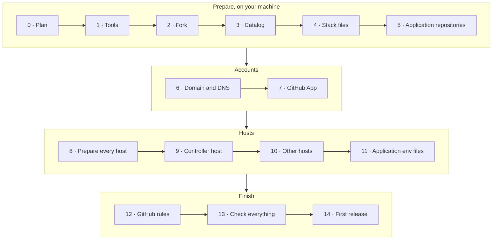

# Setting up yggdrasil

This guide takes you from nothing to a first release deployed by yggdrasil. Follow the steps in
order: each one only needs what the previous ones produced. For a complete installation on real
hardware (Docker Desktop, WSL and a VPS), see
[examples/docker-desktop-wsl-vps](examples/docker-desktop-wsl-vps/README.md).



| Step | Where | Time |
|---|---|---|
| [0. Plan the installation](#0-plan-the-installation) | Paper | 10 min |
| [1. Install the tools](#1-install-the-tools-on-your-machine) | Your machine | 10 min |
| [2. Fork yggdrasil](#2-fork-yggdrasil) | GitHub, your machine | 5 min |
| [3. Write the catalog](#3-write-the-catalog) | Your machine | 20 min |
| [4. Write the stack files](#4-write-the-stack-files) | Your machine | 10 min per application |
| [5. Prepare each application repository](#5-prepare-each-application-repository) | Each application repository | 10 min per application |
| [6. Domain and DNS](#6-domain-and-dns) | DNS provider | 15 min, plus propagation |
| [7. Create the GitHub App](#7-create-the-github-app) | GitHub | 10 min |
| [8. Prepare every host](#8-prepare-every-host) | Each host | 15 min per host |
| [9. Bring up the controller host](#9-bring-up-the-controller-host) | Controller host | 30 min |
| [10. Bring up the other hosts](#10-bring-up-the-other-environment-hosts) | Each other host | 15 min per host |
| [11. Application env files](#11-application-env-files) | Each host | 5 min per application |
| [12. Apply the GitHub rules](#12-apply-the-github-rules) | Your machine | 5 min |
| [13. Check everything](#13-check-everything) | Browser | 10 min |
| [14. The first release](#14-the-first-release) | An application repository | 10 min |

## 0. Plan the installation

Decide these before touching anything, and write the answers down: every later step uses them.

| Decision | Example | Notes |
|---|---|---|
| **GitHub owner** | `acme` | The user or organisation that owns the application repositories. Your fork of yggdrasil goes there too. |
| **Environments**, in promotion order | `development`, `staging`, `production` | For each: its `trigger` (`manual`, `branch` or `release`) and `mode` (`proxy`, or `ports` for a laptop). See [catalog.md](catalog.md#environments). |
| **One host per environment** | staging: a VM; production: a VPS | One Docker engine per environment: two environments on one engine would replace each other's containers. A VM or a WSL distribution counts as a host. A `ports` environment (a laptop) needs no host setup. |
| **The controller host** | production's VPS | The one host that also runs the Jenkins controller. It must be reachable from the internet on 443, for GitHub's webhooks. |
| **Domain per `proxy` environment** | `example.dev`, `staging.example.dev` | Every public name is one label under it. Your own domain on Cloudflare, or a free DuckDNS subdomain: [dns.md](dns.md). |
| **Systems and applications** | `shop` = `shop-api` + `shop-web` | Each application is one repository with a Dockerfile and a `/health`-style endpoint. |

A minimal installation is **one** environment (`production`, `trigger: release`) on **one** host
that also runs the controller. Start there if you are trying yggdrasil out; adding environments
later is a catalog entry and a host ([Adding things](#adding-things)).

### What each host needs

- Linux with **Docker Engine** and the **Compose plugin** (v2.24 or later, for `!reset` in the overlays): a VPS, a VM, a WSL
  distribution with its own engine.
- Roughly **2 GB of RAM** for the platform of an environment host, **4 GB** for the one that also
  runs the Jenkins controller, plus what your applications need.
- `git`, `bash`, `openssl`, and `python3` with PyYAML.
- Inbound **443** (and 80, for the HTTP→HTTPS redirect) from wherever the applications are used.
  Nothing else inbound.

## 1. Install the tools on your machine

On the machine you work from (Linux, macOS, or Windows with Git Bash):

| Tool | Why | Install |
|---|---|---|
| `git` | Everything | [git-scm.com](https://git-scm.com/downloads) |
| `python3` + PyYAML | Validating the catalog, applying the GitHub rules | `pip install pyyaml` (Ubuntu: `sudo apt install python3-yaml`) |
| GitHub CLI `gh` | Applying the GitHub rules | [cli.github.com](https://cli.github.com), then `gh auth login` as an admin of the repositories |
| `openssl` | Generating tokens, converting the GitHub App key | Included with Git Bash, macOS and most Linux distributions |
| `ssh` | Reaching the hosts | Included |

Check them:

```bash
git --version && python3 -c "import yaml; print('PyYAML ok')" && gh auth status && openssl version
```

On Windows, use `python` if `python3` isn't on the path.

## 2. Fork yggdrasil

Your installation lives in your own copy of this repository: your catalog, your stack files. Jenkins
loads its pipeline and the catalog from its **`main`** branch, and every host runs a checkout of it.

1. On GitHub, **Fork** this repository into your owner (step 0). For a private copy, use
   *Import repository* or create an empty private repository and push a clone to it: forks of
   public repositories can't be private.
2. Clone it:
   ```bash
   git clone https://github.com/<owner>/<repository>.git
   cd <repository>
   ```

## 3. Write the catalog

[`catalog.yaml`](../catalog.yaml) describes the installation. The one in the repository is a
working example ([examples/docker-desktop-wsl-vps](examples/docker-desktop-wsl-vps/README.md)):
replace it with yours. Full reference: [catalog.md](catalog.md).

1. **Top level**: `owner` is your GitHub owner. `repository` is your fork's name (omit it if it's
   `yggdrasil`).
2. **`environments`**: the ones from step 0, in promotion order. For example:
   ```yaml
   environments:
     - id: staging
       name: Staging
       trigger: branch
       branches: release/*
     - id: production
       name: Production
       trigger: release
       approval: true
   ```
3. **`systems`**: replace `heimdall` and `fortuna` with your systems and applications. For each
   application:
   - `id`: the repository name (or set `repository`).
   - `kind`: `api`, `web` or `worker`.
   - `health`: the URL the status API probes over the Docker network, `http://<id>:<port>/<path>`.
   - `host`: its public host name under `DOMAIN`, if it has one.
   - `metrics`: `<id>:<port>`, if it exposes Prometheus metrics.
   - `checks`: the names of the GitHub Actions jobs that run on **every** pull request of that
     repository. Look them up in a recent pull request's *Checks* tab.
4. **Keep the `yggdrasil` system** at the end as it is: it makes the console show the platform's
   own health.
5. Validate, and see what each application will do where:
   ```bash
   python3 scripts/catalog.py validate
   python3 scripts/catalog.py plan <application-id>
   ```

## 4. Write the stack files

`scripts/deploy.sh` combines Compose files from `stacks/` with the application's repository. The
ones in `stacks/` are working examples: copy the closest one and rename what it names.

| The application's repository | Files to add in `stacks/` |
|---|---|
| **Has its own `docker-compose.yml`** | `<id>.proxy.yml`: Traefik labels, the `edge` and `telemetry` networks with the alias `<id>`, and `ports: !reset []`. Example: [heimdall-api.proxy.yml](../stacks/heimdall-api.proxy.yml). |
| **Has only a Dockerfile** | `<id>.yml`: the service, built from `${APP_DIR}` and tagged `<id>:${IMAGE_TAG}`. Plus `<id>.proxy.yml`, and `<id>.ports.yml` if a `ports` environment deploys it. Examples: [heimdall-ui.yml](../stacks/heimdall-ui.yml) and its overlays. |

Rules to keep:
- The router names and the network alias are the application's `id`.
- In `proxy` mode, nothing publishes a host port: only Traefik does.
- Host names come from the env file (`PUBLIC_HOST`, `UI_HOST`), not hard-coded.

Delete the example stack files of applications you removed from the catalog. Then check and publish:

```bash
python3 scripts/catalog.py validate
git add -A && git commit -m "chore: describe this installation" && git push origin main
```

Push to **`main`**: it's the branch Jenkins and the hosts read.

## 5. Prepare each application repository

For every application in the catalog:

1. **A Dockerfile** that builds the application, and a **health endpoint** matching the catalog's
   `health`. Give the container a health check (`HEALTHCHECK` in the Dockerfile, or `healthcheck:`
   in the Compose file): `deploy.sh` waits for it to report healthy, and rolls back if it doesn't.
2. **A `develop` branch.** If the repository has none:
   ```bash
   git switch main && git pull && git switch -c develop && git push -u origin develop
   ```
3. **The three template files** from [`templates/application/`](../templates/application), on
   `develop`:
   - `Jenkinsfile`: replace `<application-id>` with the catalog id.
   - `.github/workflows/branch-policy.yml`: as is.
   - `CONTRIBUTING.md`: replace `<owner>` and `<application-id>`.
4. **CI** that runs the jobs listed in the catalog's `checks` on pull requests into `develop` and
   `main`.
5. Commit and push to `develop`. Until the rules are applied (step 12) a direct push works; after,
   only pull requests do.

## 6. Domain and DNS

Follow [dns.md](dns.md), up to and including *Configure the host* (A5 or B2). By the end you have:

- a `*.<DOMAIN>` record (or DuckDNS subdomain) per `proxy` environment, pointing at its host;
- your DNS provider's API credential, for each host's `acme.env`.

Check each one resolves:

```bash
dig +short anything.<DOMAIN>     # or: nslookup anything.<DOMAIN>
```

The controller's address will be `https://jenkins.<DOMAIN>`, with the `DOMAIN` of the environment
whose host runs it. Note it down: steps 7 and 9 need it.

## 7. Create the GitHub App

Jenkins talks to GitHub as a GitHub App, not as you. So it doesn't inherit your ruleset bypass, and
its merges go through the same rules as everyone's.

1. GitHub → your profile (or the organisation) → **Settings → Developer settings → GitHub Apps →
   New GitHub App**:

   | Field | Value |
   |---|---|
   | GitHub App name | Anything unique, e.g. `acme-yggdrasil` |
   | Homepage URL | `https://jenkins.<DOMAIN>` |
   | Webhook → Active | **Unchecked for now**: the controller doesn't exist yet. Step 9 turns it on. |
   | Webhook URL | `https://jenkins.<DOMAIN>/github-webhook/` (trailing slash included) |
   | Webhook secret | Empty |
   | Repository permissions | **Contents**: read and write · **Pull requests**: read and write · **Commit statuses**: read and write · **Checks**: read-only · **Metadata**: read-only |
   | Subscribe to events | **Push**, **Pull request**, **Repository** |
   | Where can this GitHub App be installed? | Only on this account |

2. **Create GitHub App.** On its page, note the **App ID**.
3. **Private keys → Generate a private key.** A `.pem` file downloads. Keep it: step 9 puts it on
   the controller host.
4. **Install App** → your owner → **Only select repositories**: every application repository in the
   catalog, and your fork of yggdrasil. When you add an application later, add its repository here
   too.

## 8. Prepare every host

On **each** host that runs a `proxy` environment, the controller host included:

1. **Docker Engine and the Compose plugin**, following
   [docs.docker.com/engine/install](https://docs.docker.com/engine/install/). Then let your user run
   Docker, and log out and back in:
   ```bash
   sudo usermod -aG docker "$USER"
   ```
2. **The other tools**:
   ```bash
   sudo apt update && sudo apt install -y git python3 python3-yaml openssl apache2-utils
   ```
   (`apache2-utils` provides `htpasswd`, for the Traefik dashboard password.)
3. **The firewall**, on the host and in the provider's panel if it has its own:
   ```bash
   sudo ufw allow OpenSSH && sudo ufw allow 80,443/tcp && sudo ufw enable
   ```
4. **Your fork and the secrets directory.** Every host gets two directories:

   | Directory | Holds | In git? |
   |---|---|---|
   | `/opt/yggdrasil` | A checkout of your fork: the catalog, the stack files, the scripts, the platform | Yes |
   | `/etc/yggdrasil` | This host's secrets: `platform.env`, `acme.env`, the GitHub App key, the application env files | **Never** |

   Run these as your own user (not as `root`), one at a time:

   1. **Create the checkout's directory**, owned by you, so you can clone, `git pull` and run the
      scripts without `sudo`:
      ```bash
      sudo install -d -o "$USER" /opt/yggdrasil
      ```
      - `install -d`: creates the directory (and any missing parent).
      - `-o "$USER"`: makes you its owner. `$USER` is filled in by the shell with your user name;
        type it as is.
      - `/opt/yggdrasil`: where the checkout goes. Keep this path: the rest of this guide uses it.
        Any other path works, since the scripts find the repository from their own location.

   2. **Clone your fork** into it:
      ```bash
      git clone -b main https://github.com/<owner>/<repository>.git /opt/yggdrasil
      ```
      - `-b main`: checks out the `main` branch, the one Jenkins reads. Hosts must run the same
        catalog as Jenkins.
      - `<owner>`: the GitHub user or organisation of your fork, the `owner` in `catalog.yaml`
        (e.g. `acme`).
      - `<repository>`: your fork's name, the `repository` in `catalog.yaml` (`yggdrasil` unless you
        renamed it).
      - `/opt/yggdrasil`: the directory from the previous command.

      For example: `git clone -b main https://github.com/acme/yggdrasil.git /opt/yggdrasil`.

      A **private** fork needs a credential. Create a read-only
      [deploy key](https://docs.github.com/en/authentication/connecting-to-github-with-ssh/managing-deploy-keys)
      for this host and clone over SSH instead:
      ```bash
      ssh-keygen -t ed25519 -N "" -C "yggdrasil@$(hostname)" -f ~/.ssh/id_ed25519
      cat ~/.ssh/id_ed25519.pub
      ```
      - `-t ed25519`: the key type. `-N ""`: no passphrase, so `git pull` works unattended.
      - `-C "yggdrasil@$(hostname)"`: a label that tells you, on GitHub, which host the key belongs to.
      - `-f ~/.ssh/id_ed25519`: where the key is written. That is SSH's default key, so `git` uses it
        without further configuration. If the file already exists, skip `ssh-keygen` and use it.

      Paste the printed public key in your fork → **Settings → Deploy keys → Add deploy key**, with
      *Allow write access* unchecked. Then clone with the SSH URL:
      `git clone -b main git@github.com:<owner>/<repository>.git /opt/yggdrasil`.

   3. **Create the secrets directory**, readable only by you:
      ```bash
      sudo install -d -m 700 -o "$USER" /etc/yggdrasil
      ```
      - `-m 700`: permissions: you can read, write and enter it; nobody else can, except `root`.
      - `-o "$USER"`: you own it, so you can edit its files without `sudo`.
      - `/etc/yggdrasil`: the default secrets directory, where `platform.sh`, `deploy.sh` and the
        Jenkins agent look. To use another path, export `YGG_SECRETS_DIR=<path>` in your shell
        profile **and** set `YGG_SECRETS_DIR=<path>` in `platform.env`.

   4. **Copy the two platform env templates** into it:
      ```bash
      cp /opt/yggdrasil/env/platform.env.example /etc/yggdrasil/platform.env
      cp /opt/yggdrasil/env/acme.env.example /etc/yggdrasil/acme.env
      ```
      - `platform.env`: the platform's settings for this host (its environment, domain, passwords,
        Jenkins). You fill it in during step 9 or 10.
      - `acme.env`: the DNS provider's credential, which Traefik uses to get certificates. You fill
        it in during step 9 or 10 too.
      - Type both lines as they are: the names are fixed, and the templates document every variable.

   5. **Lock the files down**:
      ```bash
      chmod 600 /etc/yggdrasil/*.env
      ```
      - `600`: only you can read and write them. They will hold passwords and API tokens.
      - `/etc/yggdrasil/*.env`: every env file in the directory, both files above. Run it again
        whenever you add an env file.

5. **Check it**:
   ```bash
   docker run --rm hello-world && docker compose version && python3 /opt/yggdrasil/scripts/catalog.py validate
   ```

## 9. Bring up the controller host

The controller comes up in two passes: first the controller alone, because each agent's secret only
exists once the controller has created the agent; then with its agent.

### 9.1 The GitHub App key

Copy the `.pem` from step 7 to the host, and convert it to the PKCS#8 format Jenkins requires:

```bash
openssl pkcs8 -topk8 -inform PEM -outform PEM -nocrypt -in <app>.private-key.pem -out /etc/yggdrasil/github-app.pem
chmod 600 /etc/yggdrasil/github-app.pem
rm <app>.private-key.pem
```

### 9.2 The env files, first pass

`/etc/yggdrasil/acme.env`: your DNS provider's credential (step 6), e.g. `CF_DNS_API_TOKEN=...`.

`/etc/yggdrasil/platform.env`: every variable is documented in the file. Fill in:

| Variable | Value |
|---|---|
| `ENVIRONMENT` | The id of the environment this host runs, e.g. `production` |
| `COMPOSE_PROFILES` | `jenkins` (**not** `jenkins,agent` yet) |
| `DOMAIN` | This environment's domain, e.g. `example.dev` |
| `ACME_EMAIL` | Your e-mail, for Let's Encrypt's expiry notices |
| `ACME_DNS_PROVIDER` | `cloudflare`, `duckdns`, ... |
| `ACME_CA_SERVER` | **Uncomment** it: the staging CA, for this first run |
| `TRAEFIK_DASHBOARD_USERS` | The output of `htpasswd -nB admin`, in single quotes |
| `GRAFANA_ADMIN_PASSWORD` | A password, e.g. `openssl rand -base64 24` |
| `YGGDRASIL_STATUS_TOKEN` | `openssl rand -hex 32`. The console needs it: keep a copy in your password manager |
| `JENKINS_URL` | `https://jenkins.<DOMAIN>/` |
| `JENKINS_ADMIN_PASSWORD` | A password for the Jenkins `admin` user |
| `GITHUB_APP_ID` | The App ID from step 7 |
| `GITHUB_APP_KEY_FILE` | `/etc/yggdrasil/github-app.pem` |

Leave the agent section for 9.5.

### 9.3 Start it and check the certificate

```bash
/opt/yggdrasil/scripts/platform.sh up
/opt/yggdrasil/scripts/platform.sh logs traefik | grep -i acme     # Ctrl+C to stop
```

The first start builds images and takes a few minutes. Then, from any machine:

```bash
curl -kvI https://yggdrasil.<DOMAIN> 2>&1 | grep -i issuer     # a "(STAGING)" issuer
```

Fix any error now, against the staging CA, which isn't rate limited: see
[dns.md troubleshooting](dns.md#troubleshooting). Then switch to the real certificate: comment
`ACME_CA_SERVER` out again in `platform.env`, and:

```bash
/opt/yggdrasil/scripts/platform.sh down
docker volume rm yggdrasil_letsencrypt
/opt/yggdrasil/scripts/platform.sh up
curl -I https://jenkins.<DOMAIN>/login        # no -k: the certificate is trusted
```

### 9.4 Jenkins and the webhook

1. Open `https://jenkins.<DOMAIN>` and sign in as `admin`. Jenkins has created, from the catalog:
   - one job per application;
   - one agent per environment it deploys to (**Manage Jenkins → Nodes**), all offline for now.
2. Back in the GitHub App's settings (step 7), tick **Webhook → Active** and save. Under
   **Advanced → Recent Deliveries**, the `ping` delivery should get a green check. Use *Redeliver*
   after fixing anything.

### 9.5 The env files, second pass: this host's agent

Under **Manage Jenkins → Nodes → \<this environment's agent\>**, copy the secret shown in the
connection command. Then, in `platform.env`:

| Variable | Value |
|---|---|
| `COMPOSE_PROFILES` | `jenkins,agent` |
| `JENKINS_AGENT_NAME` | The agent's name: the environment's `agent` in the catalog, or its id |
| `JENKINS_AGENT_SECRET` | The secret |
| `JENKINS_AGENT_URL` | `http://jenkins:8080/`: on this host, the agent reaches the controller over the Docker network |
| `DOCKER_GID` | The output of `getent group docker \| cut -d: -f3` |

```bash
/opt/yggdrasil/scripts/platform.sh up
```

The node now shows as connected in Jenkins.

If this host's environment is `trigger: manual` with no `agent`, Jenkins has no agent for it: leave
`COMPOSE_PROFILES=jenkins`.

## 10. Bring up the other environment hosts

For each other host, prepared as in step 8. Its env files are simpler, because the controller is
elsewhere:

- `acme.env`: the DNS credential, as in 9.2.
- `platform.env`:

  | Variable | Value |
  |---|---|
  | `ENVIRONMENT` | This host's environment id, e.g. `staging` |
  | `COMPOSE_PROFILES` | `agent` |
  | `DOMAIN`, `ACME_*`, `TRAEFIK_DASHBOARD_USERS`, `GRAFANA_ADMIN_PASSWORD` | As in 9.2, with this environment's `DOMAIN` |
  | `YGGDRASIL_STATUS_TOKEN` | A new `openssl rand -hex 32`: one token per environment |
  | `JENKINS_URL` | The **controller's** URL: `https://jenkins.<controller's DOMAIN>/` |
  | `JENKINS_AGENT_NAME`, `JENKINS_AGENT_SECRET` | From **Manage Jenkins → Nodes → \<this environment's agent\>** on the controller |
  | `JENKINS_AGENT_URL` | **Empty** |
  | `DOCKER_GID` | `getent group docker \| cut -d: -f3` |
  | `JENKINS_ADMIN_PASSWORD`, `GITHUB_APP_*` | Not needed: leave them empty |

Start with the staging CA, as in 9.3, then switch to the real certificate:

```bash
/opt/yggdrasil/scripts/platform.sh up
```

The agent dials the controller out over a WebSocket on 443, so this host needs no inbound port for
Jenkins. Its node turns connected in Jenkins.

**`ports` environments** (a developer laptop) need no platform, agent or DNS: `deploy.sh` publishes
each application on `127.0.0.1`. Set one up any time:

```bash
export YGG_SECRETS_DIR=~/yggdrasil-env      # holds <environment>/<application>.env
scripts/deploy.sh development shop-api ../shop-api dev
```

### Firewall

Docker publishes ports around `ufw`/`firewalld`. In these stacks only Traefik publishes ports (80 and 443): no other service has a `ports:` entry in `proxy` mode. Metrics, the status API's internal port and Prometheus stay on the Docker networks. Keep it that way when writing stack files.

## 11. Application env files

On each host, one file per application deployed to that host's environment: its configuration and
secrets, plus what its stack files need.

```bash
install -d -m 700 /etc/yggdrasil/<environment>
nano /etc/yggdrasil/<environment>/<application>.env
chmod 600 /etc/yggdrasil/<environment>/<application>.env
```

- Start from the application repository's own env template, if it has one.
- Add what the stack files read. The overlays in this repository use:
  - `PUBLIC_HOST`: the application's host name, `<host>.<DOMAIN>`, matching its catalog `host`;
  - `UI_HOST`: for a web UI, or an API served under its UI's origin.
- A web UI's build arguments (an API base URL, say) are compiled into its bundle: public, and
  different per environment.

`python3 /opt/yggdrasil/scripts/catalog.py environments <application-id>` lists the environments an
application deploys to. [examples/docker-desktop-wsl-vps/env](examples/docker-desktop-wsl-vps/env)
has complete examples.

## 12. Apply the GitHub rules

On your machine, in your fork, with `gh` authenticated as an admin of the repositories:

```bash
python3 github/rulesets.py --dry-run     # what would change, per repository
python3 github/rulesets.py               # apply
```

For each application repository, this:
- makes `develop` the default branch
- deletes head branches on merge
- creates the `develop`, `main` and `release tags` rulesets, with the checks from the catalog and one `deploy/<environment>` per release environment

Rulesets on **private** repositories need a paid GitHub plan. From now on, `develop` and `main`
change only through pull requests.

## 13. Check everything

| Check | Where | Expected |
|---|---|---|
| Platform containers | `scripts/platform.sh ps` on each host | Every service `running (healthy)` |
| Certificates | `https://yggdrasil.<DOMAIN>` for each environment | No browser warning |
| Webhooks | GitHub App → Advanced → Recent Deliveries | Green checks |
| Agents | Jenkins → Manage Jenkins → Nodes | Every agent connected |
| Jobs | Jenkins → each application's job → *Scan Repository Log* | Finishes with `Finished: SUCCESS`, and lists `main` and the matching branches |
| Console | `https://yggdrasil.<DOMAIN>` | The platform system is `up`. Applications are `not deployed` until the first release |
| Status API | `curl -H "Authorization: Bearer <YGGDRASIL_STATUS_TOKEN>" https://yggdrasil.<DOMAIN>/api/status` | JSON with every system of the catalog |
| Grafana | `https://grafana.<DOMAIN>`, `admin` / `GRAFANA_ADMIN_PASSWORD` | Prometheus and Loki data sources work |

**Windows and Android consoles**: install them from this repository's GitHub releases, then add
each environment in Settings with its URL (`https://yggdrasil.<DOMAIN>`) and its
`YGGDRASIL_STATUS_TOKEN`.

## 14. The first release

In an application repository prepared in step 5:

```bash
git switch develop && git pull
git switch -c release/0.1.0 && git push -u origin release/0.1.0
```

1. Environments whose `branches` match `release/*` deploy it. Follow it in Jenkins, in the
   application's job, on the `release/0.1.0` branch.
2. Open the pull request `release/0.1.0 → main`. Once its checks pass, Jenkins deploys it to each
   release environment in order, asking for approval where the catalog says so (**Deploy** in the
   build's page).
3. After the last one, Jenkins merges the pull request, tags and releases `v0.1.0`, and deletes the
   branch. The console shows the version, commit and deploy time.

If a deploy fails, it rolls back to the previous image and the pull request stays open. The
build's console output says why: usually a missing env file variable or a health check that never
passes. Fix it on `develop` (or on the host, for an env file) and cut a new release.

Day to day from here: [README.md#day-to-day](../README.md#day-to-day).

## Adding things

### An application

1. **Catalog:** add it under its system (or a new system) in `catalog.yaml`: `id`, `kind`, `health`, and if they apply `host`, `metrics` and `checks`. Add `environments` only if it doesn't deploy everywhere.
2. **Stack files** in `stacks/`, as in [step 4](#4-write-the-stack-files).
3. **The application's repository**, as in [step 5](#5-prepare-each-application-repository). Install the GitHub App on it.
4. **Env files** on each host it deploys to, as in [step 11](#11-application-env-files).
5. **Apply:**
   - push the catalog and stack files to `main` of your fork
   - `python3 github/rulesets.py <id>`
   - `git pull && scripts/platform.sh up` on the controller host, which restarts Jenkins with the new job
   - `git pull && scripts/platform.sh up` on the other hosts, so their status APIs and Prometheus pick it up

### An environment

1. **Catalog:** add it to `environments`, in promotion order, with its options, and push to `main`.
2. **DNS:** its `*.<DOMAIN>` record, as in [step 6](#6-domain-and-dns).
3. **Host:** prepare it as in [step 8](#8-prepare-every-host).
4. **Apply:**
   - `git pull && scripts/platform.sh up` on the controller host. Jenkins creates the new agent.
   - Bring the new host up as in [step 10](#10-bring-up-the-other-environment-hosts), with the new agent's secret.
   - `python3 github/rulesets.py`, if it's a release environment: `main` now also requires its `deploy/<id>`.
5. **Env files:** for each application on the new host, as in [step 11](#11-application-env-files).

### A system

A system is only a grouping: add it with its applications to `catalog.yaml`, then add the applications as above.

## Observability

- **Grafana** at `https://grafana.<DOMAIN>`, with Prometheus and Loki provisioned. Good starting dashboards to import: *ASP.NET Core* (19924), *Traefik* (17346), *Jenkins* (9964).
- **Metrics**: every catalog application with `metrics` is scraped, labelled `system`, `app` and `kind`, through the status API's service discovery. Serve metrics on a port that is neither published nor routed.
- **Logs**: Alloy ships every container's stdout to Loki, labelled `environment`, `stack`, `service`, `container` and `level` (read from JSON logs' `Level`/`level`). For example: `{stack="shop-api"} | json | Level="Error"`.

## Troubleshooting

| Symptom | Likely cause |
|---|---|
| `platform: ENVIRONMENT='...' is not an environment in catalog.yaml` | A typo in `ENVIRONMENT`, or the host's checkout is behind: `git pull` in `/opt/yggdrasil` |
| `platform: JENKINS_AGENT_SECRET must be set ...` | `COMPOSE_PROFILES` includes `agent` before the secret is filled in: see [9.5](#95-the-env-files-second-pass-this-hosts-agent) |
| `permission denied ... docker.sock` | Your user isn't in the `docker` group, or you haven't logged in again since adding it |
| Jenkins starts, but with no jobs or credentials errors | `GITHUB_APP_ID` wrong, or the key not converted to PKCS#8 ([9.1](#91-the-github-app-key)). `platform.sh logs jenkins` says which |
| A job's scan finds no branches | The GitHub App isn't installed on that repository, or the repository has no `Jenkinsfile` on the scanned branches |
| An agent stays offline | Wrong `JENKINS_AGENT_SECRET` or `JENKINS_AGENT_NAME`, or `JENKINS_URL` not reachable from that host. `platform.sh logs agent` says which |
| `deploy: missing env file ...` | The application's env file isn't at `/etc/yggdrasil/<environment>/<application>.env` ([step 11](#11-application-env-files)) |
| `deploy/<environment>` never appears on the pull request | The release environment's agent is offline, or a GitHub check never finishes (a path-filtered workflow in `checks`) |
| Certificates, DNS, webhook deliveries | [dns.md troubleshooting](dns.md#troubleshooting) |
