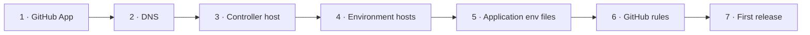

# Setting up yggdrasil

This guide sets up an installation from scratch. It assumes a catalog already describing your
environments and applications ([catalog.md](catalog.md)). For a complete walk-through on real
hardware, see [examples/docker-desktop-wsl-vps](examples/docker-desktop-wsl-vps/README.md).



## What you need

- A **GitHub** account or organisation with the application repositories, and your fork of this repository.
- A **domain** whose DNS is hosted by a provider [Traefik supports](https://doc.traefik.io/traefik/https/acme/#providers) (Cloudflare, Route 53, DigitalOcean, OVH, Gandi...), and an API credential for it.
- **One host per environment** that Jenkins deploys to, each with its own Docker Engine and the Compose plugin: a VPS, a VM, a WSL distribution... One of them, reachable from the internet over HTTPS, also runs the **Jenkins controller**.
- On every host: `git`, `python3` with PyYAML (`apt install python3-yaml`), and `bash`.

## 1. The GitHub App

Jenkins talks to GitHub as a GitHub App, not as you. So it doesn't inherit your ruleset bypass, and its merges go through the same rules as everyone's.

1. GitHub → Settings → Developer settings → GitHub Apps → **New GitHub App** (under the organisation, if the repositories belong to one).
   - Homepage URL: `https://jenkins.<domain>`
   - Webhook URL: `https://jenkins.<domain>/github-webhook/`, active
   - Repository permissions:
     - **Contents**: read and write (merge, tags, delete branches)
     - **Pull requests**: read and write
     - **Commit statuses**: read and write
     - **Checks**: read-only
     - **Metadata**: read-only
   - Events: **Push**, **Pull request**, **Repository**
2. Generate a private key and convert it to the PKCS#8 format Jenkins requires. It goes on the controller host:
   ```bash
   openssl pkcs8 -topk8 -inform PEM -outform PEM -nocrypt -in <app>.private-key.pem -out /etc/yggdrasil/github-app.pem
   ```
3. Install the app on every application repository in the catalog, and on your fork of yggdrasil.

## 2. DNS

Each environment has a `DOMAIN`, and every public host name of that environment is one label under it: `<host>.<DOMAIN>`. Traefik gets one wildcard certificate `*.<DOMAIN>` per environment through the DNS-01 challenge, which works for hosts behind NAT too.

- For each environment, add a record `*.<DOMAIN>` → that host's address. A private address is fine for an environment only used on a LAN.
- Create an API credential for your DNS provider that can edit the zone's records. It goes in `acme.env` on each host.

The controller's host name is `jenkins.<DOMAIN>` of its host's environment. It must be reachable from GitHub for webhooks.

## 3. The controller host

```bash
# Docker Engine and the Compose plugin: https://docs.docker.com/engine/install/
sudo git clone https://github.com/<owner>/<repository>.git /opt/yggdrasil
sudo install -d -m 700 -o "$USER" /etc/yggdrasil
cp /opt/yggdrasil/env/platform.env.example /etc/yggdrasil/platform.env
cp /opt/yggdrasil/env/acme.env.example /etc/yggdrasil/acme.env
```

Fill in both files. `platform.env` documents every variable; the ones that matter on this host:

- `ENVIRONMENT`: the id of the environment this host runs.
- `DOMAIN`, `ACME_EMAIL`, `ACME_DNS_PROVIDER`, plus the provider's credentials in `acme.env`.
- `YGGDRASIL_STATUS_TOKEN=$(openssl rand -hex 32)`, `GRAFANA_ADMIN_PASSWORD`, `TRAEFIK_DASHBOARD_USERS`.
- `COMPOSE_PROFILES=jenkins` **for now**: the agent's secret doesn't exist until the controller does.
- `JENKINS_URL=https://jenkins.<DOMAIN>/`, `JENKINS_ADMIN_PASSWORD`, `GITHUB_APP_ID`, `GITHUB_APP_KEY_FILE`.

```bash
/opt/yggdrasil/scripts/platform.sh up
```

Open `https://jenkins.<DOMAIN>` and sign in. Jenkins has created:
- one job per application in the catalog
- one agent per environment it deploys to

Under **Manage Jenkins → Nodes → \<this host's agent\>**, copy the secret into `JENKINS_AGENT_SECRET`. Then set:
- `COMPOSE_PROFILES=jenkins,agent`
- `JENKINS_AGENT_NAME` (the agent's name)
- `JENKINS_AGENT_URL=http://jenkins:8080/`
- `DOCKER_GID=$(getent group docker | cut -d: -f3)`

Run `platform.sh up` again. The agent shows as connected.

## 4. Every other environment host

The same, without the controller:

```bash
sudo git clone https://github.com/<owner>/<repository>.git /opt/yggdrasil
sudo install -d -m 700 -o "$USER" /etc/yggdrasil
cp /opt/yggdrasil/env/platform.env.example /etc/yggdrasil/platform.env   # and fill in
cp /opt/yggdrasil/env/acme.env.example /etc/yggdrasil/acme.env           # and fill in
/opt/yggdrasil/scripts/platform.sh up
```

with:
- `ENVIRONMENT` and `DOMAIN` for this environment
- `COMPOSE_PROFILES=agent`
- `JENKINS_AGENT_NAME` and `JENKINS_AGENT_SECRET` from the controller's node page
- `JENKINS_URL` pointing at the controller
- `JENKINS_AGENT_URL` **empty**

The agent dials the controller out over a WebSocket on 443, so this host needs no inbound port for Jenkins. It does need 443 inbound for the applications themselves.

**Environments with `mode: ports`** (a developer laptop) need no platform at all. `deploy.sh` publishes each application on `127.0.0.1`:

```bash
export YGG_SECRETS_DIR=~/yggdrasil-env      # holds <environment>/<application>.env
scripts/deploy.sh development shop-api ../shop-api dev
```

### Firewall

Docker publishes ports around `ufw`/`firewalld`. In these stacks only Traefik publishes ports (80 and 443): no other service has a `ports:` entry in `proxy` mode. Metrics, the status API's internal port and Prometheus stay on the Docker networks. Keep it that way when writing stack files.

## 5. Application env files

On each host, one file per application deployed there: `/etc/yggdrasil/<environment>/<application>.env`, `chmod 600`. They hold the application's configuration and secrets for that environment, plus what its stack files need. The overlays copied from this repository use:
- `PUBLIC_HOST`: its host name under `DOMAIN`
- `UI_HOST`: for a web UI, or an API served under its UI's origin

When the application's repository has its own Compose file and env template, start from that template.

## 6. GitHub rules

On your machine, with `gh` authenticated as an admin of the repositories and PyYAML installed:

```bash
python github/rulesets.py --dry-run     # what would change, per repository
python github/rulesets.py               # apply
```

For each application repository, this:
- makes `develop` the default branch
- deletes head branches on merge
- creates the `develop`, `main` and `release tags` rulesets, with the checks from the catalog and one `deploy/<environment>` per release environment

Rulesets on **private** repositories need a paid GitHub plan.

## 7. The first release

In an application repository with the files from `templates/application/`:

```bash
git switch develop && git pull
git switch -c release/0.1.0 && git push -u origin release/0.1.0
```

Environments whose `branches` match `release/*` deploy it. Open the pull request into `main`: once its checks pass, Jenkins deploys it to the release environments, then merges and tags it. Follow along in Jenkins, and in the console at `https://yggdrasil.<DOMAIN>`.

## Adding things

### An application

1. **Catalog:** add it under its system (or a new system) in `catalog.yaml`: `id`, `kind`, `health`, and if they apply `host`, `metrics` and `checks`. Add `environments` only if it doesn't deploy everywhere.
2. **Stack files** in `stacks/`:
   - A repository with its own `docker-compose.yml` needs only `<id>.proxy.yml`. It adds Traefik labels, joins the `edge` and `telemetry` networks with an alias equal to the id, and has no host ports.
   - A repository without one also needs `<id>.yml` (the service, built from `${APP_DIR}` and tagged `<id>:${IMAGE_TAG}`) and `<id>.ports.yml` (development).
   - Copy the closest existing file.
3. **The application's repository:** the files in `templates/application/`, with its id in the `Jenkinsfile`. Install the GitHub App on it.
4. **Env files** on each host it deploys to.
5. **Apply:**
   - `python github/rulesets.py <id>`
   - `git pull && scripts/platform.sh up` on the controller host, which restarts Jenkins with the new job
   - `git pull && scripts/platform.sh up` on the other hosts, so their status APIs and Prometheus pick it up

### An environment

1. **Catalog:** add it to `environments`, in promotion order, with its options.
2. **Host:** give it one, as in step 4, with `ENVIRONMENT` set to the new id and its own `DOMAIN` and DNS record.
3. **Apply:**
   - `git pull && scripts/platform.sh up` on the controller host. Jenkins creates the new agent; put its secret in the new host's `platform.env`.
   - `python github/rulesets.py`, if it's a release environment: `main` now also requires its `deploy/<id>`.
4. **Env files:** add them for each application on the new host.

### A system

A system is only a grouping: add it with its applications to `catalog.yaml`, then add the applications as above.

## Observability

- **Grafana** at `https://grafana.<DOMAIN>`, with Prometheus and Loki provisioned. Good starting dashboards to import: *ASP.NET Core* (19924), *Traefik* (17346), *Jenkins* (9964).
- **Metrics**: every catalog application with `metrics` is scraped, labelled `system`, `app` and `kind`, through the status API's service discovery. Serve metrics on a port that is neither published nor routed.
- **Logs**: Alloy ships every container's stdout to Loki, labelled `environment`, `stack`, `service`, `container` and `level` (read from JSON logs' `Level`/`level`). For example: `{stack="shop-api"} | json | Level="Error"`.
